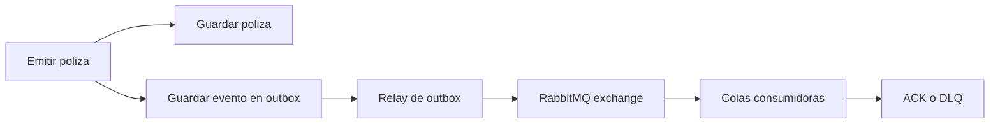
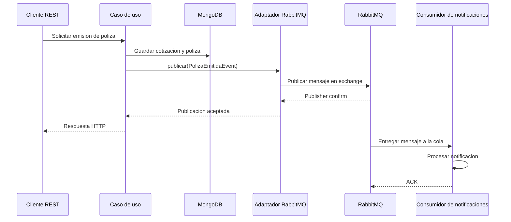

# Implementacion de RabbitMQ y consumidor independiente de WhatsApp

> **Nota (2026-09-28):** el monolito se retiró del repositorio. Las rutas `Arquitectura-Clean/...`, el contenedor `andina-clean-mongodb` y los comandos `cd Arquitectura-Clean` de este documento describen el estado de su momento: hoy el Compose y el `.env` están en la raíz y el código del monolito queda en la etiqueta de git `monolito-final`. Ver [q_RETIRO-DEL-MONOLITO.md](../5.%20Microservicios/q_RETIRO-DEL-MONOLITO.md).

> Estado: publicación implementada en Clean, Hexagonal y Onion; envío local eliminado y WhatsApp exclusivo de `notification-consumer`. Véase el inventario final y código impactado en [`IMPLEMENTACION-BACKENDS-RABBITMQ.md`](../IMPLEMENTACION-BACKENDS-RABBITMQ.md).
>
> **Actualización (fase 1 de la migración a microservicios):** `notification-consumer` pasó a ser `services/notification-service`, con base propia y sin leer la colección `clientes` del backend. Este documento se conserva como historia; el diseño vigente está en [`../5. Microservicios/f_IMPLEMENTACION-NOTIFICATION-SERVICE-FASE1.md`](../5.%20Microservicios/f_IMPLEMENTACION-NOTIFICATION-SERVICE-FASE1.md).

## 1. Alcance y conclusion

Los tres proyectos pueden incorporar RabbitMQ sin romper las reglas de su arquitectura. Las APIs publican eventos y un sistema separado, `notification-consumer`, consume los mensajes y envia WhatsApp. Los tres proyectos ya tienen un contrato para publicar eventos de dominio y mantienen la implementacion fuera del nucleo:

| Proyecto  | Contrato existente                                     | Implementacion externa actual         | Ubicacion del adaptador RabbitMQ |
| --------- | ------------------------------------------------------ | ------------------------------------- | -------------------------------- |
| Clean     | `usecases.port.out.event.DomainEventPublisherPort`   | `SpringDomainEventPublisherAdapter` | `interfaceadapters.out.event`  |
| Hexagonal | `core.ports.out.event.DomainEventPublisherPort`      | `SpringDomainEventPublisherAdapter` | `adapters.outbound.event`      |
| Onion     | `application.gateway.event.DomainEventPublisherPort` | `SpringDomainEventPublisherAdapter` | `infrastructure.event`         |

La integracion no debe agregar clases de RabbitMQ en `entities`, `core.domain`, `usecases`, `application` ni en los puertos internos. RabbitMQ es un detalle de infraestructura y se incorpora como un adaptador.

El evento inicial recomendado es `PolizaEmitidaEvent`, porque ya se genera al completar la emision de una poliza y actualmente se usa para notificaciones.

> Nota sobre el PDF `Arquitectura Orientada a Eventos.pdf`: el archivo esta en la raiz del repositorio. Esta guia aplica sus principios de productores desacoplados, consumidores independientes, procesamiento asincrono, reintentos, idempotencia y manejo de fallos. La implementacion descrita aqui es exclusivamente RabbitMQ y se basa en el modelo AMQP de exchanges, bindings y queues.

## 2. Arquitectura actual

El flujo actual de emision de poliza es equivalente en los tres proyectos:

```text
Cliente REST
    -> Controlador
    -> Caso de uso EmitirPoliza
    -> Guardar cotizacion en MongoDB
    -> Guardar poliza en MongoDB
    -> DomainEventPublisherPort.publicar(PolizaEmitidaEvent)
    -> ApplicationEventPublisher local
    -> listener local de notificaciones
```

Los casos de uso no conocen Spring ni el mecanismo concreto de eventos. Por ejemplo, el caso de uso Clean recibe `DomainEventPublisherPort` por constructor. La misma abstraccion existe en Hexagonal y Onion.

## 3. Flujo propuesto con RabbitMQ

RabbitMQ no reemplaza el contrato de dominio. Cambia el transporte:

```text
API de polizas
  -> RabbitMqDomainEventPublisherAdapter
  -> Exchange
  -> Binding con routing key
  -> andina.policy.notification.queue
  -> notification-consumer
  -> ClienteContactPort / MongoDB
  -> NotificationPort
  -> WhatsAppNotificationAdapter
  -> JSON.pe

La aplicacion consumidora es un proceso independiente de las tres APIs. No debe implementarse como un nuevo handler local ni depender de `ApplicationEventPublisher`.
```

## 4. Modelo de RabbitMQ

Para `PolizaEmitida` se propone:

| Elemento            | Valor sugerido                             | Responsabilidad                                             |
| ------------------- | ------------------------------------------ | ----------------------------------------------------------- |
| Exchange            | `andina.events`                          | Recibir eventos de negocio                                  |
| Tipo de exchange    | `topic`                                  | Enrutar por patrones de routing key                         |
| Routing key         | `policy.issued.v1`                       | Identificar el tipo y version del evento                    |
| Cola                | `andina.notifications.policy-issued`     | Entregar eventos al consumidor de notificaciones            |
| Servicio consumidor | `notification-consumer`           | Proceso independiente que consume la cola de notificaciones |
| DLX                 | `andina.events.dlx`                      | Recibir mensajes rechazados o agotados                      |
| DLQ                 | `andina.notifications.policy-issued.dlq` | Almacenar mensajes no procesables                           |

Una cola debe tener un consumidor por cada responsabilidad. Si auditoria y notificaciones necesitan recibir el mismo evento, deben existir dos colas enlazadas al mismo exchange:

```text
andina.events
  +-- policy.issued.v1 -> andina.notifications.policy-issued
  +-- policy.issued.v1 -> andina.audit.policy-issued
  +-- policy.issued.v1 -> andina.billing.policy-issued
```

No se debe crear una unica cola compartida para notificaciones, auditoria y facturacion, porque los consumidores se repartirian los mensajes y cada responsabilidad no recibiria su propia copia.

## 5. Cambios comunes paso a paso

### Paso 1. Agregar la dependencia Maven

Modificar los tres archivos:

- `Arquitectura-Clean/pom.xml`
- `Arquitectura-Hexagonal/pom.xml`
- `Arquitectura-Onion/pom.xml`

Agregar:

```xml
<dependency>
    <groupId>org.springframework.boot</groupId>
    <artifactId>spring-boot-starter-amqp</artifactId>
</dependency>
```

Spring Boot `3.3.5` administra una version compatible de Spring AMQP y del cliente RabbitMQ.

No es necesario agregar una dependencia RabbitMQ a ningun paquete del dominio.

### Paso 2. Agregar RabbitMQ al Docker Compose

El archivo global actual tiene MongoDB y los tres backends, pero no tiene broker. Agregar al `docker-compose.yml` de la raiz:

```yaml
  rabbitmq:
    image: rabbitmq:3.13-management
    container_name: andina-rabbitmq
    restart: unless-stopped
    ports:
      - "5672:5672"
      - "15672:15672"
    environment:
      RABBITMQ_DEFAULT_USER: ${RABBITMQ_DEFAULT_USER:andina}
      RABBITMQ_DEFAULT_PASS: ${RABBITMQ_DEFAULT_PASS:andina-local}
    volumes:
      - rabbitmq_data:/var/lib/rabbitmq
    networks:
      - rabbitmq_network
    healthcheck:
      test: ["CMD", "rabbitmq-diagnostics", "-q", "ping"]
      interval: 5s
      timeout: 5s
      retries: 15
```

Agregar el volumen y la red:

```yaml
volumes:
  rabbitmq_data:
    name: andina_rabbitmq_data

networks:
  rabbitmq_network:
    name: andina_rabbitmq_network
```

Cada backend debe conectarse a dos redes: su red propia y `rabbitmq_network`. Ejemplo para Onion:

```yaml
  onion-backend:
    environment:
      SPRING_RABBITMQ_HOST: rabbitmq
      SPRING_RABBITMQ_PORT: 5672
      SPRING_RABBITMQ_USERNAME: andina
      SPRING_RABBITMQ_PASSWORD: andina-local
    networks:
      - onion_network
      - rabbitmq_network
    depends_on:
      onion-mongodb:
        condition: service_healthy
      rabbitmq:
        condition: service_healthy
```

Aplicar el mismo cambio a `hexagonal-backend` y `clean-backend`.

Los Compose individuales tambien deben actualizarse:

- `Arquitectura-Clean/docker-compose.yml`
- `Arquitectura-Hexagonal/docker-compose.yml`
- `Arquitectura-Onion/docker-compose.yml`

En un Compose individual hay dos opciones validas:

1. Declarar un RabbitMQ propio por proyecto, con aislamiento completo.
2. Usar el RabbitMQ compartido externo, conectando el backend a una red Docker externa ya creada.

Para este repositorio conviene la primera opcion cuando se ejecuta un proyecto de forma aislada. Para las tres aplicaciones juntas conviene un broker compartido. No se deben declarar dos servicios con el mismo `container_name` al levantar el Compose global y uno individual al mismo tiempo.

### Paso 3. Configurar la conexion y los nombres de mensajeria

Agregar en cada `src/main/resources/application.yml`:

```yaml
spring:
  rabbitmq:
    host: ${SPRING_RABBITMQ_HOST:rabbitmq}
    port: ${SPRING_RABBITMQ_PORT:5672}
    username: ${SPRING_RABBITMQ_USERNAME:andina}
    password: ${SPRING_RABBITMQ_PASSWORD:andina-local}
    publisher-confirm-type: correlated
    publisher-returns: true
    listener:
      simple:
        acknowledge-mode: manual
        default-requeue-rejected: false
        prefetch: 10
        retry:
          enabled: true
          max-attempts: 3
          initial-interval: 1000ms
          multiplier: 2
          max-interval: 10000ms

app:
  rabbitmq:
    exchange: ${RABBITMQ_EXCHANGE:andina.events}
    dead-letter-exchange: ${RABBITMQ_DLX:andina.events.dlx}
    policy-issued-routing-key: ${RABBITMQ_POLICY_ISSUED_KEY:policy.issued.v1}
    notification-queue: ${RABBITMQ_NOTIFICATION_QUEUE:andina.notifications.policy-issued}
```

En cada proyecto se debe conservar la configuracion de Mongo, JWT, CORS y servicios externos existente.

### Paso 4. Definir un contrato de integracion estable

No publicar directamente la clase interna `PolizaEmitidaEvent`. Crear un mensaje externo equivalente en la capa de infraestructura:

```java
public record PolizaEmitidaMessage(
        UUID eventId,
        Instant occurredAt,
        UUID polizaId,
        UUID cotizacionId,
        UUID clienteId,
        String numeroPoliza,
        String eventType,
        int schemaVersion) {}
```

El mensaje debe tener:

- `eventId` para idempotencia;
- `occurredAt` para auditoria;
- identificadores de negocio;
- `eventType`;
- `schemaVersion`;
- solo datos necesarios para el consumidor;
- ningun objeto Spring, Mongo o entidad mutable.

La `messageId` y la clave de negocio deben ser deterministas cuando sea posible. Para este evento se puede usar `polizaId` como identificador de correlacion.

### Paso 5. Crear exchange, colas y bindings

Registrar una configuracion Spring AMQP en la capa externa:

```java
@Bean
TopicExchange andinaEventsExchange(AppRabbitProperties properties) {
    return new TopicExchange(properties.exchange());
}

@Bean
Queue policyIssuedQueue(AppRabbitProperties properties) {
    return QueueBuilder.durable(properties.notificationQueue())
            .deadLetterExchange(properties.deadLetterExchange())
            .deadLetterRoutingKey("policy.issued.v1.dlq")
            .build();
}

@Bean
Binding policyIssuedBinding(
        Queue policyIssuedQueue,
        TopicExchange andinaEventsExchange,
        AppRabbitProperties properties) {
    return BindingBuilder.bind(policyIssuedQueue)
            .to(andinaEventsExchange)
            .with(properties.policyIssuedRoutingKey());
}
```

En una implementacion completa deben declararse tambien el exchange de dead letters y su cola. Las colas deben ser durables y los mensajes persistentes.

### Paso 6. Crear el adaptador publicador

El adaptador debe implementar el puerto que ya existe y usar `RabbitTemplate` unicamente fuera del nucleo:

```java
public class RabbitMqDomainEventPublisherAdapter
        implements DomainEventPublisherPort {

    private final RabbitTemplate rabbitTemplate;
    private final AppRabbitProperties properties;
    private final PolizaEmitidaMessageMapper mapper;

    @Override
    public void publicar(DomainEvent event) {
        if (event instanceof PolizaEmitidaEvent polizaEmitida) {
            PolizaEmitidaMessage message = mapper.toMessage(polizaEmitida);
            rabbitTemplate.convertAndSend(
                    properties.exchange(),
                    properties.policyIssuedRoutingKey(),
                    message);
            return;
        }
        throw new IllegalArgumentException(
                "Evento no soportado: " + event.getClass().getName());
    }
}
```

Configurar un `Jackson2JsonMessageConverter` para no enviar serializacion Java nativa:

```java
@Bean
Jackson2JsonMessageConverter rabbitMessageConverter(ObjectMapper objectMapper) {
    return new Jackson2JsonMessageConverter(objectMapper);
}
```

Debe habilitarse publisher confirm y registrar callbacks para confirmar o registrar el fallo de entrega. Un `convertAndSend` sin confirmacion no garantiza que RabbitMQ haya aceptado el mensaje.

### Paso 7. Sustituir el bean del publicador

En la configuracion de cada proyecto se debe sustituir el bean actual:

```java
@Bean
DomainEventPublisherPort domainEventPublisher(ApplicationEventPublisher publisher) {
    return new SpringDomainEventPublisherAdapter(publisher);
}
```

por un bean equivalente que reciba `RabbitTemplate`.

No modificar los constructores de los casos de uso. La inyeccion continua siendo por `DomainEventPublisherPort`.

### Paso 8. Convertir el handler en consumidor

El handler actual usa `@TransactionalEventListener` para eventos locales de Spring. Si se elimina `ApplicationEventPublisher`, ese handler ya no recibira `PolizaEmitidaEvent`.

Crear un consumidor RabbitMQ que:

1. Reciba `PolizaEmitidaMessage`.
2. Valide version y campos obligatorios.
3. Compruebe idempotencia.
4. Ejecute la notificacion.
5. Envie ACK solo cuando la operacion termine correctamente.
6. Envie NACK sin requeue cuando el mensaje sea invalido.
7. Permita reintentos para fallos transitorios.
8. Envie a DLQ los mensajes agotados.

Ejemplo conceptual:

```java
@RabbitListener(queues = "${app.rabbitmq.notification-queue}")
public void consumir(PolizaEmitidaMessage message, Channel channel, Message rawMessage)
        throws IOException {
    long tag = rawMessage.getMessageProperties().getDeliveryTag();
    try {
        idempotencyStore.assertNotProcessed(message.eventId());
        notificationService.notificar(message);
        idempotencyStore.markProcessed(message.eventId());
        channel.basicAck(tag, false);
    } catch (TransientNotificationException exception) {
        channel.basicNack(tag, false, true);
    } catch (Exception exception) {
        channel.basicNack(tag, false, false);
    }
}
```

La politica exacta de requeue debe evitar loops infinitos. En produccion es preferible usar una cola de retry con TTL o una politica de reintentos controlada y una DLQ.

## 6. Implementacion especifica por arquitectura

### 6.1 Clean Architecture

#### Archivos que cambiarian

| Archivo o carpeta                                                                                                | Cambio                                                                                            |
| ---------------------------------------------------------------------------------------------------------------- | ------------------------------------------------------------------------------------------------- |
| `Arquitectura-Clean/pom.xml`                                                                                   | Agregar`spring-boot-starter-amqp`.                                                              |
| `Arquitectura-Clean/src/main/resources/application.yml`                                                        | Configurar conexion, exchange, colas, reintentos y nombres.                                       |
| `Arquitectura-Clean/src/main/java/com/andinaseguros/frameworksdrivers/configuration/spring/UseCaseConfig.java` | Registrar RabbitMQ y seleccionar el adaptador como implementacion de`DomainEventPublisherPort`. |
| `Arquitectura-Clean/src/main/java/com/andinaseguros/interfaceadapters/out/event/`                              | Agregar publicador RabbitMQ, DTO de integracion y mapper.                                         |
| `notification-consumer`                                                                                 | Crear consumidor, idempotencia y adaptador de WhatsApp.                                           |
| `Arquitectura-Clean/src/test/java/com/andinaseguros/interfaceadapters/out/event/`                              | Probar publicador y mapper.                                                                       |
| `Arquitectura-Clean/src/test/java/com/andinaseguros/architecture/CleanArchitectureTest.java`                   | Solo si las reglas necesitan reconocer las nuevas clases externas.                                |
| `docker-compose.yml` y Compose individual                                                                      | Agregar RabbitMQ, red, credenciales y dependencia de salud.                                       |

#### Archivos que no deben cambiar

- `entities/event/PolizaEmitidaEvent.java`;
- `entities/model/Poliza.java`;
- `usecases/service/poliza/EmitirPolizaUseCase.java`;
- `usecases/port/out/event/DomainEventPublisherPort.java`;
- DTOs internos de `usecases`.

#### Por que es compatible

En Clean, `usecases.port.out` define la necesidad del caso de uso y `interfaceadapters.out` implementa detalles externos. RabbitMQ pertenece a `interfaceadapters.out.event`; su configuracion y conexion pertenecen a `frameworksdrivers.configuration`.

La direccion de dependencias se conserva:

```text
frameworksdrivers -> interfaceadapters -> usecases -> entities
```

El caso de uso no sabe si el evento se publica en Spring, RabbitMQ, otro broker o una implementacion de prueba.

#### Flujo Clean

```text
EmitirPolizaUseCase
    -> DomainEventPublisherPort
    -> RabbitMqDomainEventPublisherAdapter
    -> RabbitTemplate
    -> andina.events
    -> andina.notifications.policy-issued
    -> notification-consumer
    -> NotificationPort
    -> WhatsAppNotificationAdapter
```

### 6.2 Arquitectura Hexagonal

#### Archivos que cambiarian

| Archivo o carpeta                                                                                      | Cambio                                                                        |
| ------------------------------------------------------------------------------------------------------ | ----------------------------------------------------------------------------- |
| `Arquitectura-Hexagonal/pom.xml`                                                                     | Agregar`spring-boot-starter-amqp`.                                          |
| `Arquitectura-Hexagonal/src/main/resources/application.yml`                                          | Configurar RabbitMQ y las propiedades de mensajeria.                          |
| `Arquitectura-Hexagonal/src/main/java/com/andinaseguros/bootstrap/UseCaseConfiguration.java`         | Ensamblar el adaptador RabbitMQ y declarar la configuracion AMQP.             |
| `Arquitectura-Hexagonal/src/main/java/com/andinaseguros/adapters/outbound/event/`                    | Agregar adaptador publicador, mapper y DTO.                                   |
| `notification-consumer`                                                                       | Crear consumidor, idempotencia y adaptador de WhatsApp.                       |
| `Arquitectura-Hexagonal/src/test/java/com/andinaseguros/adapters/outbound/event/`                    | Agregar pruebas del adaptador y mapper.                                       |
| `Arquitectura-Hexagonal/src/test/java/com/andinaseguros/architecture/HexagonalArchitectureTest.java` | Verificar que las implementaciones de puertos siguen viviendo en`adapters`. |
| `docker-compose.yml` y Compose individual                                                            | Agregar servicio RabbitMQ y conexion de red.                                  |

#### Archivos que no deben cambiar

- `core/domain/**`;
- `core/application/service/poliza/EmitirPolizaService.java`;
- `core/ports/out/event/DomainEventPublisherPort.java`;
- `core/application/dto/**`;
- `core/ports/in/**` salvo que RabbitMQ vaya a recibir comandos.

#### Por que es compatible

RabbitMQ es un adapter outbound cuando publica eventos y un adapter inbound cuando recibe comandos. El puerto queda en `core.ports` y la implementacion queda en `adapters`.

Si el sistema debe aceptar comandos desde RabbitMQ, agregar:

```text
core/ports/in/poliza/EmitirPolizaUseCase.java  (ya existente)
adapters/inbound/rabbitmq/EmitirPolizaRabbitConsumer.java
```

El consumidor inbound debe convertir el mensaje externo a `EmitirPolizaCommand` y llamar al puerto de entrada existente. No debe llamar directamente al servicio ni al repositorio.

#### Flujo Hexagonal de salida

```text
REST adapter -> core.ports.in -> core application service
    -> core.ports.out.event
    -> RabbitMQ outbound adapter
    -> exchange -> queue
```

#### Flujo Hexagonal de entrada opcional

```text
RabbitMQ inbound adapter
    -> mensaje externo
    -> EmitirPolizaCommand
    -> core.ports.in.poliza.EmitirPolizaUseCase
    -> caso de uso
```

### 6.3 Arquitectura Onion

#### Archivos que cambiarian

| Archivo o carpeta                                                                               | Cambio                                                  |
| ----------------------------------------------------------------------------------------------- | ------------------------------------------------------- |
| `Arquitectura-Onion/pom.xml`                                                                  | Agregar`spring-boot-starter-amqp`.                    |
| `Arquitectura-Onion/src/main/resources/application.yml`                                       | Configurar RabbitMQ y las propiedades de mensajeria.    |
| `Arquitectura-Onion/src/main/java/com/andinaseguros/infrastructure/config/UseCaseConfig.java` | Registrar beans de RabbitMQ y seleccionar el gateway.   |
| `Arquitectura-Onion/src/main/java/com/andinaseguros/infrastructure/event/`                    | Agregar publicador RabbitMQ, mapper y DTO.              |
| `notification-consumer`                                                                | Crear consumidor, idempotencia y adaptador de WhatsApp. |
| `Arquitectura-Onion/src/test/java/com/andinaseguros/infrastructure/event/`                    | Probar la infraestructura AMQP.                         |
| `Arquitectura-Onion/src/test/java/com/andinaseguros/architecture/OnionArchitectureTest.java`  | Confirmar que AMQP solo aparece en infraestructura.     |
| `docker-compose.yml` y Compose individual                                                     | Agregar RabbitMQ, volumen, red y credenciales.          |

#### Archivos que no deben cambiar

- `domain/**`;
- `domain/repository/**`;
- `domain/event/**`;
- `application/service/poliza/EmitirPolizaUseCase.java`;
- `application/gateway/event/DomainEventPublisherPort.java`;
- `application/dto/**`.

#### Por que es compatible

En Onion, las abstracciones pertenecen a `domain` o `application.gateway` y las implementaciones pertenecen a `infrastructure`. RabbitMQ es infraestructura, por lo que no debe entrar al dominio ni a los servicios de aplicacion.

La direccion se conserva:

```text
infrastructure -> application -> domain
presentation -> application
```

El adaptador RabbitMQ no debe ubicarse en `application.gateway`; ahi debe permanecer solamente el contrato.

#### Flujo Onion

```text
presentation.controller
    -> application.service.EmitirPolizaUseCase
    -> application.gateway.event.DomainEventPublisherPort
    -> infrastructure.event.RabbitMqDomainEventPublisherAdapter
    -> RabbitMQ
```

## 7. Que hacer con el publicador local actual

Hay dos estrategias.

### Estrategia recomendada para la migracion: adaptador compuesto

Mantener temporalmente el publicador local y publicar tambien en RabbitMQ:

```text
CompositeDomainEventPublisher
  +-- SpringDomainEventPublisherAdapter
  +-- RabbitMqDomainEventPublisherAdapter
```

Ventajas:

- No se rompe la notificacion local durante la migracion.
- Permite validar RabbitMQ sin cambiar todo el flujo de una vez.
- Facilita comparar eventos locales y mensajes externos.

Riesgo:

- Si la misma notificacion sigue activa en Spring y RabbitMQ, se enviara dos veces.
- El consumidor RabbitMQ debe tener idempotencia.
- Debe definirse claramente que responsabilidades permanecen locales y cuales migran al broker.

### Estrategia final: reemplazar el publicador local

Sustituir `SpringDomainEventPublisherAdapter` por RabbitMQ y convertir `PolizaEmitidaNotificationHandler` en consumidor RabbitMQ.

Es la opcion mas limpia si el objetivo es que la notificacion sea asincrona. El caso de uso sigue sin cambios.

## 8. Consistencia entre MongoDB y RabbitMQ

El codigo actual guarda datos en MongoDB y publica despues:

```text
1. Guardar cotizacion.
2. Guardar poliza.
3. Publicar PolizaEmitidaEvent.
```

Si MongoDB confirma y RabbitMQ esta caido, la poliza existe pero el evento puede no publicarse. Publisher confirms detecta el fallo, pero no deshace automaticamente MongoDB.

### Integracion directa

Adecuada para una practica o demostracion:

- `RabbitTemplate.convertAndSend`;
- publisher confirms;
- timeout y logs;
- reintentos limitados;
- respuesta de error si la publicacion falla.

No garantiza consistencia distribuida.

### Outbox con MongoDB

Adecuada para produccion:



Agregar, en cada proyecto:

```text
outbox/
  OutboxEventDocument
  OutboxEventRepository
  OutboxRepositoryAdapter
  OutboxRelay
```

La poliza y el registro Outbox deben guardarse en la misma transaccion MongoDB. Para esto MongoDB necesita replica set, tambien en Docker local. El relay publica mensajes pendientes, espera confirmacion de RabbitMQ y marca el registro como publicado.

Estados sugeridos:

```text
PENDING -> PUBLISHING -> PUBLISHED
                    \-> FAILED
```

El relay debe ser idempotente porque puede publicar y fallar antes de marcar el registro. El consumidor tambien debe ser idempotente porque RabbitMQ trabaja con entrega al menos una vez.

## 9. Impacto funcional del flujo

### Antes

- La respuesta HTTP publica un evento local dentro de la aplicacion.
- El handler local puede ejecutarse inmediatamente despues del commit.
- No existe una cola persistente para recuperar eventos.
- El procesamiento depende del ciclo de vida de la aplicacion.

### Despues

- La respuesta HTTP confirma la emision, no necesariamente la notificacion.
- El evento queda almacenado en RabbitMQ hasta ser consumido.
- El consumidor puede ejecutarse en otra instancia o servicio.
- El orden se controla por cola, no por ejecucion local global.
- El procesamiento es eventual.
- Un mensaje puede entregarse mas de una vez.
- ACK, NACK, retry y DLQ pasan a formar parte del flujo.

## 10. Impacto tecnico y operativo

### Beneficios

- Desacoplamiento entre emision y notificaciones.
- Colas persistentes y control de backpressure.
- Reintentos administrados por el broker y el consumidor.
- Multiples colas para auditoria, facturacion y analitica.
- Escalado horizontal de consumidores.
- Menor dependencia del ciclo de vida del backend HTTP.

### Costos y riesgos

- Se agrega un servicio de infraestructura y una red Docker compartida.
- Es necesario administrar exchanges, queues y bindings.
- El contrato del mensaje debe versionarse.
- Pueden existir duplicados y mensajes fuera de orden.
- La publicacion directa no es atomica con MongoDB.
- Un consumidor bloqueado puede acumular mensajes.
- Hay que monitorizar profundidad de colas, tasa de ACK, NACK, DLQ y latencia.
- Las credenciales de desarrollo no deben pasar a produccion.

### Cambios de comportamiento de la API

La API debe continuar devolviendo la poliza creada. No debe esperar a que el correo o WhatsApp finalice. Si el requisito de negocio exige confirmacion de notificacion, ese dato debe modelarse explicitamente como estado y no depender de mantener bloqueado el request HTTP.

## 11. Reintentos, ACK y DLQ

Politica recomendada:

| Situacion                                | Accion                 |
| ---------------------------------------- | ---------------------- |
| Mensaje procesado correctamente          | ACK                    |
| Error temporal de WhatsApp o API externa | Retry con backoff      |
| Mensaje mal formado                      | NACK sin requeue y DLQ |
| Error de negocio no recuperable          | NACK sin requeue y DLQ |
| Error de infraestructura transitorio     | Reintento limitado     |
| Mensaje duplicado ya procesado           | ACK sin repetir efecto |

No se debe usar `requeue=true` indefinidamente, porque puede crear un ciclo rapido de reentrega.

## 12. Idempotencia

RabbitMQ ofrece entrega al menos una vez cuando se usan ACK. Por ello el consumidor debe guardar una marca de procesamiento:

```text
processed_events
  event_id: UUID
  consumer: notification-service
  processed_at: Instant
```

Antes de notificar:

1. Buscar `eventId` y consumidor.
2. Si ya existe, hacer ACK y terminar.
3. Si no existe, procesar la notificacion.
4. Registrar el `eventId`.
5. Hacer ACK.

La operacion de notificacion debe usar una clave de idempotencia cuando el proveedor externo la soporte.

## 13. Pruebas necesarias

En cada proyecto agregar o adaptar:

- prueba unitaria del `RabbitMqDomainEventPublisherAdapter` con `RabbitTemplate` mockeado;
- prueba del mapper de `PolizaEmitidaEvent` a `PolizaEmitidaMessage`;
- prueba de exchange, routing key y nombre de cola;
- prueba de publisher confirm y publisher return;
- prueba del consumidor con ACK exitoso;
- prueba de NACK, retry y DLQ;
- prueba de mensaje duplicado;
- prueba de mensaje incompatible con la version del esquema;
- prueba de integracion con Testcontainers RabbitMQ;
- prueba de Outbox si se implementa;
- prueba ArchUnit de aislamiento del broker.

Los tests de los casos de uso no necesitan cambiar si siguen simulando `DomainEventPublisherPort`. Deben continuar verificando que una emision publica un evento y que una emision invalida no publica nada.

## 14. Orden recomendado de implementacion

### Fase 1: infraestructura minima

1. Agregar `spring-boot-starter-amqp` a los tres POM.
2. Agregar RabbitMQ al Compose global.
3. Conectar los tres backends a `rabbitmq_network`.
4. Configurar credenciales por variables de entorno.
5. Declarar exchange, cola, binding, DLX y DLQ.

### Fase 2: publicacion

6. Crear `PolizaEmitidaMessage` y mapper en cada capa externa.
7. Crear el adaptador RabbitMQ que implemente el puerto existente.
8. Configurar publisher confirms.
9. Cambiar el bean de composicion en cada arquitectura.
10. Publicar `policy.issued.v1` al emitir una poliza.

### Fase 3: consumo

11. Crear el consumidor RabbitMQ en la capa externa correspondiente.
12. Migrar la notificacion local o evitar duplicarla durante la transicion.
13. Configurar ACK manual y reintentos.
14. Configurar DLQ y observabilidad.
15. Implementar idempotencia.

### Fase 4: confiabilidad

16. Implementar Outbox en MongoDB.
17. Configurar replica set para las pruebas de transacciones.
18. Crear relay con confirmaciones y reintentos.
19. Probar recuperacion despues de apagar RabbitMQ.
20. Medir acumulacion de colas, fallos y tiempos de procesamiento.

## 15. Resultado esperado por arquitectura

| Arquitectura | Lugar correcto de RabbitMQ                                                    | Resultado                                                        |
| ------------ | ----------------------------------------------------------------------------- | ---------------------------------------------------------------- |
| Clean        | `interfaceadapters.out.event` y configuracion en `frameworksdrivers`      | El caso de uso depende del puerto, no de AMQP.                   |
| Hexagonal    | `adapters.outbound.event`; `adapters.inbound.rabbitmq` si recibe comandos | RabbitMQ se trata como adapter de entrada o salida.              |
| Onion        | `infrastructure.event` y configuracion en `infrastructure.config`         | El dominio y la aplicacion permanecen libres de infraestructura. |

La implementacion es viable en los tres proyectos. La modificacion correcta no consiste en insertar RabbitMQ en los casos de uso, sino en sustituir o complementar el adaptador local de eventos, declarar la topologia AMQP, convertir el listener en consumidor y resolver la consistencia MongoDB-RabbitMQ con Outbox cuando el sistema requiera confiabilidad de produccion.



    ## 16. Decision definitiva antes de programar

    Esta es la implementacion que debe ejecutarse primero. Evita mezclar decisiones de migracion, escalamiento y consistencia fuerte en un mismo cambio.

    ### 16.1 Contrato correcto del evento

    No crear `PolicyIssuedEvent` dentro del dominio para reemplazar `PolizaEmitidaEvent`. Los tres proyectos ya tienen el evento interno:

    ``java     public record PolizaEmitidaEvent(       UUID eventId,       Instant occurredAt,       UUID polizaId,       UUID cotizacionId,       UUID clienteId,       String numeroPoliza)       implements DomainEvent {}     ``

    RabbitMQ debe transportar un contrato externo, creado en la capa externa de cada arquitectura:

    ```java
    public record PolicyIssuedMessage(
      UUID eventId,
      String eventType,
      int eventVersion,
      Instant occurredAt,
      UUID aggregateId,
      PolicyIssuedData data) {}

    public record PolicyIssuedData(
      UUID policyId,
      UUID quoteId,
      UUID customerId,
      String policyNumber) {}
    ```

    El campo `vehicleId` que aparece en el documento de la tarea no existe actualmente en `PolizaEmitidaEvent`. No debe inventarse en el mapper. Hay que agregarlo al evento de dominio solamente si un consumidor realmente lo necesita y si la regla de negocio lo considera parte del hecho. De lo contrario, el contrato inicial debe usar los cuatro datos disponibles.

    El mapeo es:

    ``text     PolizaEmitidaEvent       evento interno, usado por el caso de uso       |       v     PolicyIssuedMessage      contrato JSON externo, usado por RabbitMQ     ``

    ### 16.2 Topologia unica para los tres proyectos

    Para levantar las tres APIs juntas se usara un RabbitMQ compartido:

    ```text
    Exchange: andina.insurance.events
    Tipo: topic
    Routing key: policy.issued.v1

    Queue de notificacion: andina.policy.notification.queue
    Queue de auditoria: andina.policy.audit.queue
    DLX: andina.insurance.events.dlx
    DLQ de notificacion: andina.policy.notification.dlq
    ```

    Cada responsabilidad tiene una cola propia. No se deben conectar notificacion y auditoria a una misma cola, porque RabbitMQ distribuiria los mensajes entre consumidores en vez de entregar una copia a cada responsabilidad.

    La red comun se agrega al Compose global. Los backends conservan sus redes Mongo propias y se conectan tambien a la red RabbitMQ. Los Compose individuales deben declarar un broker local con los mismos nombres logicos o documentar que usan una red externa; no se deben ejecutar simultaneamente el Compose global y el individual con los mismos nombres de contenedor.

    ### 16.3 Orden exacto de cambios

    1. Agregar `spring-boot-starter-amqp` a los tres `pom.xml`.
    2. Agregar RabbitMQ y `rabbitmq_network` al `docker-compose.yml` de la raiz.
    3. Agregar la conexion del backend a RabbitMQ en los tres Compose globales.
    4. Repetir la configuracion en los tres Compose individuales para que funcionen por separado.
    5. Agregar las propiedades `spring.rabbitmq` y `app.rabbitmq` a los tres `application.yml`.
    6. Crear el DTO `PolicyIssuedMessage` y `PolicyIssuedData` en la capa externa.
    7. Crear el mapper desde `PolizaEmitidaEvent`.
    8. Crear el adaptador que implemente el `DomainEventPublisherPort` existente.
    9. Cambiar unicamente el bean de composicion que hoy crea `SpringDomainEventPublisherAdapter`.
    10. Declarar exchange, queues, bindings, DLX y DLQ.
    11. Crear el consumidor de notificaciones.
    12. Elegir un solo origen para la notificacion: local o RabbitMQ. No dejar ambos activos sin idempotencia.
    13. Agregar ACK manual, reintentos limitados, DLQ e idempotencia.
    14. Probar primero la emision, publicacion y consumo de `policy.issued.v1`.
    15. Implementar Outbox despues de validar el flujo basico, si se requiere confiabilidad ante la caida del broker.

    ### 16.4 Matriz final de archivos

| Proyecto  | Agregar o modificar                                                                                                                                                                      | No modificar                                                                                         |
| --------- | ---------------------------------------------------------------------------------------------------------------------------------------------------------------------------------------- | ---------------------------------------------------------------------------------------------------- |
| Clean     | `pom.xml`; `src/main/resources/application.yml`; `frameworksdrivers/configuration/spring/UseCaseConfig.java`; `interfaceadapters/out/event/*`; tests de infraestructura; Compose | `entities/*`; `usecases/service/*`; `usecases/port/out/event/DomainEventPublisherPort.java`    |
| Hexagonal | `pom.xml`; `src/main/resources/application.yml`; `bootstrap/UseCaseConfiguration.java`; `adapters/outbound/event/*`; tests de adapters; Compose                                  | `core/domain/*`; `core/application/*`; `core/ports/out/event/DomainEventPublisherPort.java`    |
| Onion     | `pom.xml`; `src/main/resources/application.yml`; `infrastructure/config/UseCaseConfig.java`; `infrastructure/event/*`; tests de infraestructura; Compose                         | `domain/*`; `application/service/*`; `application/gateway/event/DomainEventPublisherPort.java` |

    ### 16.5 Cambio del bean de eventos

    Actualmente cada proyecto tiene un bean equivalente a:

    ``java     @Bean     DomainEventPublisherPort domainEventPublisher(ApplicationEventPublisher publisher) {         return new SpringDomainEventPublisherAdapter(publisher);     }     ``

    Debe sustituirse por:

    ``java     @Bean     DomainEventPublisherPort domainEventPublisher(       RabbitTemplate rabbitTemplate,       PolicyIssuedMessageMapper mapper,       AppRabbitProperties properties) {         return new RabbitMqDomainEventPublisherAdapter(           rabbitTemplate, mapper, properties);     }     ``

    El constructor de `EmitirPolizaUseCase`, `EmitirPolizaService` o el caso de uso Onion no cambia. Solo cambia la implementacion inyectada del puerto.

    ### 16.6 Impacto funcional por etapa

| Etapa               | Comportamiento                                                                  | Riesgo                                                                |
| ------------------- | ------------------------------------------------------------------------------- | --------------------------------------------------------------------- |
| Antes de RabbitMQ   | La notificacion usa`ApplicationEventPublisher` dentro de la misma aplicacion. | Si el proceso cae, no existe una cola externa que conserve el evento. |
| Publicador RabbitMQ | El caso de uso guarda Mongo y envia`PolicyIssuedMessage` al exchange.         | Mongo y RabbitMQ no forman una transaccion atomica.                   |
| Consumidor RabbitMQ | La notificacion ocurre asincronamente desde una cola.                           | La respuesta HTTP no garantiza que WhatsApp ya haya terminado.        |
| ACK e idempotencia  | El mensaje se confirma solo despues del efecto exitoso.                         | Puede haber redelivery y se necesita una marca por`eventId`.        |
| Outbox              | Evento y cambio de negocio se persisten juntos antes del relay.                 | Requiere transacciones Mongo y mas componentes operativos.            |

    ### 16.7 Que no se debe implementar

    - No importar `RabbitTemplate` desde `entities`, `domain`, `usecases`, `core` o `application`.
    - No poner `@RabbitListener` en un caso de uso.
    - No serializar directamente entidades de dominio como contrato publico.
    - No usar una sola cola para notificaciones, auditoria y facturacion.
    - No dejar activo el listener local y el consumidor RabbitMQ para la misma notificacion sin idempotencia.
    - No agregar CQRS ni Event Sourcing: no son necesarios para esta integracion.
    - No asumir que publisher confirms resuelve la consistencia con MongoDB; solo confirma la aceptacion del mensaje por RabbitMQ.

    ### 16.8 Resultado esperado por arquitectura

    Clean conserva la direccion `frameworksdrivers -> interfaceadapters -> usecases -> entities`; RabbitMQ vive en `interfaceadapters.out.event` y se ensambla desde `frameworksdrivers`.

    Hexagonal conserva que el core solo conoce puertos; RabbitMQ es un adapter outbound al publicar y seria un adapter inbound unicamente si se reciben comandos desde colas.

    Onion conserva `infrastructure -> application -> domain`; RabbitMQ vive en `infrastructure.event` y nunca en `domain` ni en `application`.

    Por tanto, los tres proyectos son implementables. La funcionalidad de negocio no cambia: se sigue emitiendo la poliza desde el mismo caso de uso. Lo que cambia es que `PolizaEmitidaEvent` deja de disparar solamente una accion local y pasa a producir un mensaje externo, durable y asincrono, que RabbitMQ enruta hacia cada responsabilidad consumidora.
