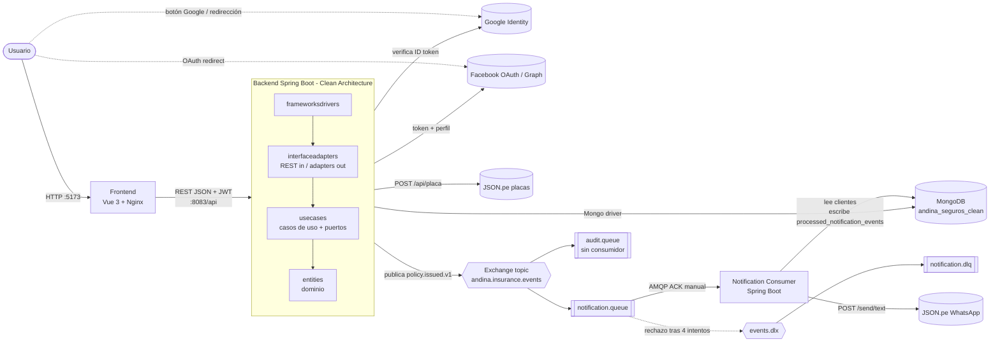

# Andina Seguros — Especificación de la arquitectura actual

Documento para dibujar el diagrama de arquitectura. Todo lo que aparece aquí se verificó en el código y en los `docker-compose.yml`. Lo que no existe en el código se marca como **Observación**.

---

## 1. Vista general

Sistema de seguros vehiculares con **3 aplicaciones desplegables** (Frontend, Backend y Notification Consumer) y **2 infraestructuras** (MongoDB y RabbitMQ):

| # | Componente | Tipo | Tecnología | Contenedor | Puerto host → contenedor |
|---|---|---|---|---|---|
| 1 | **Frontend** | SPA estática servida por Nginx | Vue 3.5, TypeScript, Vite 6, Pinia, Vue Router, Axios | `frontend` (nginx:1.27-alpine) | `5173 → 80` |
| 2 | **Backend** (`andina-seguros-clean`) | API REST | Java 21, Spring Boot, Spring Security, Spring Data MongoDB, Spring AMQP | `andina-clean-backend` | `8083 → 8080` |
| 3 | **Notification Consumer** (`notification-consumer`) | Worker sin HTTP | Java 21, Spring Boot, Spring AMQP, Spring Data MongoDB | `consumer` | ninguno (no expone puerto) |
| 4 | **MongoDB** | Base de datos | `mongo:8`, base `andina_seguros_clean` | `andina-clean-mongodb` | `27020 → 27017` |
| 5 | **RabbitMQ** | Message broker | `rabbitmq:3.13-management` | `rabbitmq` | `5672 → 5672` (AMQP), `15672 → 15672` (UI) |

**Sistemas externos** (fuera de Docker):

| Sistema | Lo usa | Para qué | Protocolo |
|---|---|---|---|
| Google Identity Services | Frontend (botón) y Backend (verificación del ID token) | Login con Google | HTTPS / JWT firmado |
| Facebook OAuth + Graph API v22.0 | Backend | Login con Facebook | HTTPS, OAuth 2.0 authorization code |
| JSON.pe API de placas (`https://api.json.pe`, `POST /api/placa`) | Backend | Consultar datos de un vehículo por placa | HTTPS, Bearer token |
| JSON.pe WhatsApp (`https://api.whatsapp.json.pe`, `POST /send/text`) | Consumer | Enviar el mensaje de póliza emitida | HTTPS, Bearer token |
| Google Authenticator (app del usuario) | Usuario final | Generar el código TOTP del MFA | No es una conexión de red; solo comparte el secreto por QR |

---

## 2. Conexiones (aristas del diagrama)

| Origen | Destino | Protocolo / detalle | Sentido |
|---|---|---|---|
| Navegador | Frontend (Nginx) | HTTP `:5173`, entrega el bundle estático (`try_files … /index.html`) | request → response |
| Navegador (código Vue) | Backend | HTTP REST JSON `http://localhost:8083/api`, header `Authorization: Bearer <JWT>`, timeout 15 s | request → response |
| Navegador | Google Identity Services | Script `google.accounts.id` carga el botón; devuelve un ID token (`credential`) | navegador ↔ Google |
| Navegador | Facebook | Redirección completa (`window.location.assign`) a `GET /api/auth/facebook`, que redirige a Facebook | redirecciones |
| Backend | MongoDB | Driver Mongo, `mongodb://mongodb:27017/andina_seguros_clean` | lectura/escritura |
| Backend | RabbitMQ | AMQP, publica en el exchange `andina.insurance.events` con confirmaciones (`publisher-confirm-type: correlated`, `publisher-returns`, `mandatory`) | solo publica |
| Backend | Google | Verifica el ID token (issuer `https://accounts.google.com`, `client-id` propio) | saliente |
| Backend | Facebook Graph | `token-uri`, `/me`, permisos, todo por HTTPS | saliente |
| Backend | JSON.pe placas | `POST /api/placa` | saliente |
| RabbitMQ | Consumer | AMQP, `@RabbitListener` sobre `andina.policy.notification.queue`, ACK manual, prefetch 10 | entrega |
| Consumer | MongoDB | **Lee** `clientes` para obtener el teléfono; **escribe** `processed_notification_events` (idempotencia) | lectura/escritura |
| Consumer | JSON.pe WhatsApp | `POST /send/text` con Bearer token, timeout 5 s | saliente |
| Consumer | RabbitMQ | Redeclara la topología y, tras agotar reintentos, rechaza el mensaje hacia la DLQ | ack/nack |

Lo que **no existe**: el frontend nunca habla con RabbitMQ, MongoDB ni el Consumer. El Backend nunca llama al Consumer directamente, solo por RabbitMQ. El Consumer no tiene API HTTP.

---

## 3. Redes y despliegue Docker

Fuente de verdad del stack completo: [Arquitectura-Clean/docker-compose.yml](../../Arquitectura-Clean/docker-compose.yml) (proyecto `andina-clean`).

| Servicio | Redes |
|---|---|
| `mongodb` | `clean_network` |
| `backend` | `clean_network`, `rabbitmq_network` |
| `rabbitmq` | `rabbitmq_network` |
| `consumer` | `clean_network`, `rabbitmq_network` |
| `frontend` | red por defecto del compose; solo lo consume el navegador, no habla con otros contenedores |

Volúmenes: `clean_mongo_data` (nombre real `andina_clean_mongo_data`) para Mongo y `rabbitmq_data` para RabbitMQ.

Orden de arranque (`depends_on` con healthcheck): `mongodb` y `rabbitmq` primero → luego `backend` y `consumer`. El frontend no depende de nada.

El frontend se compila con `VITE_API_URL=http://localhost:8083/api` y `VITE_GOOGLE_CLIENT_ID` como *build args*. Es decir, la URL del backend queda incrustada en el bundle; el navegador llama al backend, no Nginx.

Nota: el [docker-compose.yml](../../docker-compose.yml) de la raíz solo levanta `clean-mongodb` + `clean-backend` (sin RabbitMQ, consumer ni frontend). Para el diagrama completo usa el de `Arquitectura-Clean`.

---

## 4. Frontend

- **Stack:** Vue 3, Pinia (`stores/auth.ts`), Vue Router (`router/index.ts`), Axios (`services/api.ts`), Vitest.
- **Almacenamiento en el navegador:** `localStorage` (`token`, `role`, `username`) y `sessionStorage` (`mfaChallenge`).
- **Interceptores Axios:** el de request añade el JWT; el de response, ante 401 o 403 `TOKEN_INVALIDO`, borra la sesión y redirige a `/login?session=expired`. También traduce códigos de error del backend a mensajes.
- **Guardia de rutas** (`router.beforeEach`): exige autenticación salvo rutas públicas, exige un `mfaChallenge` para `/mfa-verification` y filtra por rol.

| Ruta | Vista | Roles |
|---|---|---|
| `/login` | LoginView (usuario/contraseña, botón Google, botón Facebook) | pública |
| `/mfa-verification` | MfaVerificationView | pública, requiere desafío MFA |
| `/seguridad` | MfaSetupView | cualquier autenticado |
| `/mi-cuenta` | MiCuentaView | CLIENTE |
| `/dashboard` | DashboardView | ADMIN, ACTUARIO, AGENTE |
| `/clientes` | ClientesView | ADMIN, AGENTE |
| `/tarifas` | TarifasView | ADMIN, ACTUARIO |
| `/cotizaciones` | CotizacionesView | ADMIN, AGENTE |
| `/polizas` | PolizasView | ADMIN, AGENTE |
| `/renovaciones` | RenovacionesView | ADMIN, AGENTE |

Todas las rutas privadas cuelgan de `layouts/AppLayout.vue`. Tras el login, CLIENTE va a `/mi-cuenta` y el resto a `/dashboard`.

---

## 5. Backend (Arquitectura Clean)

Paquete raíz `com.andinaseguros`. Un solo módulo Maven, cuatro capas. La regla de dependencia (hacia adentro) la verifica `CleanArchitectureTest` con ArchUnit, y forma parte del build de la imagen Docker (si falla, no se construye).

```
frameworksdrivers      (círculo externo: arranque y configuración Spring)
   └─ interfaceadapters (controladores REST entrantes + adaptadores salientes)
        └─ usecases     (casos de uso + puertos in/out + DTOs)
             └─ entities (modelo de dominio, reglas, eventos)
```

### 5.1 Capa `entities` (dominio puro)
- **Modelos:** Cliente, Vehiculo, Cotizacion, Poliza, Siniestro, PropuestaRenovacion, TablaTarifaria, FactorRiesgo, ResultadoTarificacion, Usuario.
- **Value objects:** Dinero, PeriodoVigencia, Placa.
- **Servicios de dominio:** MotorDeTarificacion, EvaluadorRenovacion, CalculadorPrimaRenovacion, PoliticaVariacionPrima.
- **Enums:** EstadoCotizacion, EstadoPoliza, EstadoRenovacion, EstadoSiniestro, EstadoTablaTarifaria, RolUsuario (`ADMIN`, `AGENTE`, `ACTUARIO`, `CLIENTE`), TipoUso, TipoVehiculo.
- **Eventos:** `DomainEvent`, `PolizaEmitidaEvent`.
- **Excepciones:** DomainException, RecursoNoEncontradoException, ReglaNegocioException.

### 5.2 Capa `usecases`
- **Puertos de entrada (`port.in`):** ConsultarInformacionVehiculoUseCase, CrearCotizacionInputPort, EmitirPolizaInputPort, RegistrarClienteUseCase, RegistrarVehiculoUseCase. El resto de los controladores llama directamente a las clases `*UseCase`.
- **Casos de uso (`service`)**, por agrupación:
  - `auth`: AutenticarUsuario, AutenticarConGoogle, AutenticarConFacebook, DesvincularFacebook, ObtenerPerfil, RegistrarUsuario, VerificarMfa.
  - `mfa`: ConfigurarMfa, ActivarMfa, DesactivarMfa, ObtenerEstadoMfa.
  - `cliente`: CrearCliente, ListarClientes, ObtenerCliente, ObtenerMiCuenta.
  - `vehiculo`: CrearVehiculo, ListarVehiculosCliente; más ConsultarInformacionVehiculoService.
  - `cotizacion`: CrearCotizacion, AceptarCotizacion, ListarCotizaciones, ListarCotizacionesPendientesEmision, ObtenerCotizacion.
  - `poliza`: EmitirPoliza, ListarPolizas, ObtenerPoliza.
  - `siniestro`: RegistrarSiniestro, ActualizarEstadoSiniestro, ListarSiniestros.
  - `renovacion`: EvaluarRenovacion, AprobarRenovacion, RechazarRenovacion, GenerarPolizaRenovada, ListarRenovaciones, ListarHistorialRenovaciones, ObtenerRenovacion.
  - `tarifa`: CrearTablaTarifaria, ListarTablasTarifarias, ObtenerTablaTarifaria.
- **Puertos de salida (`port.out`)** y quién los implementa:

| Puerto | Adaptador (en `interfaceadapters/out`) | Destino |
|---|---|---|
| Cliente/Cotizacion/Poliza/Renovacion/Siniestro/TablaTarifaria/Usuario/Vehiculo `Repository` | `*MongoRepositoryAdapter` (9 adaptadores, con `Document`, `Mapper` y `SpringData…Repository`) | MongoDB |
| `DomainEventPublisherPort` | `RabbitMqDomainEventPublisherAdapter` (+ `PolicyIssuedMessageMapper`) | RabbitMQ |
| `VehicleInformationPort` | `JsonPeVehicleInformationAdapter` (+ `JsonPeClient`, `JsonPeVehicleMapper`) | JSON.pe placas |
| `GoogleIdentityVerifierPort` | `GoogleIdentityVerifierAdapter` | Google |
| `FacebookOAuthPort` | `FacebookOAuthAdapter` | Facebook |
| `OAuthStatePort` | `InMemoryOAuthStateAdapter` (TTL 300 s) | memoria del proceso |
| `LoginTicketPort` | `InMemoryLoginTicketAdapter` (TTL 60 s) | memoria del proceso |
| `SecretEncryptionPort` | `AesGcmSecretEncryptionAdapter` (cifra el token de Facebook) | local |
| `TokenGeneratorPort` / `TokenValidationPort` | `JwtTokenAdapter` (JJWT, expira en 28800 s = 8 h) | local |
| `PasswordEncoderPort` | `BCryptPasswordEncoderAdapter` | local |
| `MfaSecretGeneratorPort` / `TotpVerifierPort` | `TotpSecurityAdapter` | local |
| `QrCodeGeneratorPort` | `ZxingQrCodeAdapter` | local |
| `MfaChallengePort` | `InMemoryMfaChallengeAdapter` (TTL 300 s) | memoria del proceso |
| `IdGeneratorPort` | `UuidGeneratorAdapter` | local |
| `ClockPort` | `SystemClockAdapter` | local |

### 5.3 Capa `interfaceadapters/in/rest`
Controladores, DTOs `request`/`response`, `RestRequestMapper` y `GlobalExceptionHandler`.

| Base | Endpoints | Autorización |
|---|---|---|
| `/api/auth` | `POST /register`, `POST /login`, `POST /google`, `POST /mfa/verificar`, `GET /facebook`, `GET /facebook/callback`, `POST /facebook/session`, `DELETE /facebook`, `GET /me`, `POST /logout` | `/api/auth/**` es pública en la cadena de filtros; `me`, `logout` y `DELETE /facebook` exigen `isAuthenticated()` |
| `/api/mfa` | `POST /configurar`, `POST /activar`, `DELETE`, `GET /estado` | autenticado |
| `/api/mi-cuenta` | `GET` | autenticado (rol CLIENTE) |
| `/api/clientes` | `POST`, `GET`, `GET /{id}`, `POST /{id}/vehiculos`, `GET /{id}/vehiculos` | `ADMIN`, `AGENTE` en las anotaciones vistas |
| `/api/vehiculos` | `GET /informacion-externa` (consulta JSON.pe) | autenticado |
| `/api/tablas-tarifarias` | `POST`, `GET`, `GET /{id}` | `ADMIN`, `ACTUARIO` |
| `/api/cotizaciones` | `GET`, `GET /pendientes-emision`, `POST`, `GET /{id}`, `PATCH /{id}/aceptar` | autenticado |
| `/api/polizas` | `POST` (emitir), `GET`, `GET /{id}` | autenticado |
| `/api/polizas/{polizaId}/siniestros` | `POST`, `GET`, `PATCH /{id}/estado` | autenticado |
| `/api/renovaciones` | `GET`, `GET /{id}`, `GET /poliza/{id}/historial`, `POST /poliza/{id}/evaluar`, `PATCH /{id}/aprobar`, `PATCH /{id}/rechazar`, `POST /{id}/generar-poliza` | autenticado |

Documentación: Swagger UI en `/swagger-ui.html` (pública).

### 5.4 Capa `frameworksdrivers`
- `bootstrap/MotorTarificacionApplication`: `main` de Spring Boot.
- `configuration/spring/UseCaseConfig`: crea los beans de casos de uso y los conecta con los adaptadores.
- `SecurityConfig`: stateless, CSRF desactivado, CORS con orígenes de `CORS_ALLOWED_ORIGINS`, `JwtAuthenticationFilter` antes de `UsernamePasswordAuthenticationFilter`, `@EnableMethodSecurity`.
- `RabbitMqConfiguration`: declara exchanges, colas y bindings (ver §7).
- `MongoConfiguration`, `MongoIndexConfiguration` (`auto-index-creation: true`), `MongoDemoDataInitializer` (datos y usuarios demo al arrancar), `OpenApiConfig`.

### 5.5 Seguridad (resumen para el diagrama)
1. Usuario y contraseña → `POST /api/auth/login`. Si el usuario tiene MFA, responde `requiresMfa` + `challengeToken` (vive 300 s en memoria) y el frontend va a `/mfa-verification`, que llama a `POST /api/auth/mfa/verificar` con el código TOTP.
2. Google: el botón entrega un ID token → `POST /api/auth/google` → el backend lo verifica con Google y emite su propio JWT.
3. Facebook: `GET /api/auth/facebook` (state anti-CSRF, 300 s) → Facebook → `GET /api/auth/facebook/callback` → redirige al frontend `/login?ticket=…` (ticket de un solo uso, 60 s) → `POST /api/auth/facebook/session` canjea el ticket por el JWT. El token de Facebook se guarda cifrado con AES-GCM.
4. Toda llamada posterior lleva `Authorization: Bearer <JWT>`; `JwtAuthenticationFilter` la valida sin sesión de servidor.

---

## 6. MongoDB

Una sola base, `andina_seguros_clean`, compartida por Backend y Consumer.

| Colección | Dueño (escribe) | Otros accesos |
|---|---|---|
| `usuarios` | Backend | — |
| `clientes` | Backend | **Consumer la lee** (teléfono y nombre) |
| `vehiculos` | Backend | — |
| `tablas_tarifarias` | Backend | — |
| `cotizaciones` | Backend | — |
| `polizas` | Backend | — |
| `siniestros` | Backend | — |
| `propuestas_renovacion` | Backend | — |
| `processed_notification_events` | **Consumer** | — |

Índices con nombre en el código: `codigo_version_unique` (`codigo`+`version`, único) y `provider_identity` (`provider`+`providerUserId`, único y sparse, para identidades sociales). Además hay índices únicos y por `polizaId` / `polizaOrigenId`.

---

## 7. RabbitMQ (topología exacta)

Declarada por el Backend y redeclarada por el Consumer (mismas definiciones).

| Elemento | Nombre | Propiedades |
|---|---|---|
| Exchange de eventos | `andina.insurance.events` | tipo `topic`, durable |
| Exchange de dead letter | `andina.insurance.events.dlx` | tipo `topic`, durable |
| Routing key | `policy.issued.v1` | |
| Cola de notificaciones | `andina.policy.notification.queue` | durable; `x-dead-letter-exchange = …events.dlx`, `x-dead-letter-routing-key = policy.issued.v1.dlq` |
| Cola dead letter | `andina.policy.notification.dlq` | durable |
| Cola de auditoría | `andina.policy.audit.queue` | durable, bound a `policy.issued.v1` |

Bindings: `events` —`policy.issued.v1`→ `notification.queue`; `events` —`policy.issued.v1`→ `audit.queue`; `events.dlx` —`policy.issued.v1.dlq`→ `notification.dlq`.

**Observación:** `audit.queue` recibe copias de cada evento, pero **no hay ningún consumidor de esa cola** en el código. Dibújala como cola sin consumidor o márcala "reservada".

### Contrato del mensaje (`PolicyIssuedMessage`, JSON)
```
eventId        UUID
eventType      "PolicyIssued"
eventVersion   1
occurredAt     Instant (ISO-8601)
aggregateId    UUID
data:
  policyId     UUID
  quoteId      UUID
  customerId   UUID
  policyNumber string
```
El teléfono **no** viaja en el evento; el Consumer lo busca en Mongo por `customerId`.

---

## 8. Notification Consumer

Paquete `com.andinaseguros.notification`. Es un servicio en capas simples (no Clean):

| Paquete | Clase | Rol |
|---|---|---|
| `messaging` | `RabbitMqNotificationConsumer` | `@RabbitListener` sobre la cola `andina.policy.notification.queue`; controla ACK manual |
| `idempotency` | `IdempotencyService`, `ProcessedEvent`, `ProcessedEventRepository` | Evita reenvíos; clave `eventId:notification-service` en `processed_notification_events` |
| `service` | `PolicyNotificationService` | Valida el evento, busca el contacto y arma el mensaje |
| `contact` | `ClienteContactService`, `ClienteContactRepository`, `ClienteDocument`, `ClienteContact` | Lectura de `clientes` en Mongo |
| `notification` | `NotificationPort`, `WhatsAppNotificationAdapter`, `WhatsAppClient`, `WhatsAppDtos`, `NotificationConfiguration` | Puerto + adaptador para JSON.pe WhatsApp |
| `config` | `RabbitMqConfiguration`, `*Properties` | Topología, conversor JSON, reintentos |

**Flujo interno (para un diagrama de secuencia):**
1. Llega el mensaje. Si `eventId` ya se procesó, hace ACK y termina.
2. `PolicyNotificationService.notifyPolicyIssued`: valida (`eventType == "PolicyIssued"`, `eventVersion == 1`, `customerId` y `policyNumber` presentes).
3. Busca el cliente en `clientes`; si no tiene teléfono lanza error.
4. Normaliza el número (solo dígitos) y llama `POST /send/text` en JSON.pe con el texto "Su poliza {número} fue emitida correctamente."
5. Si `success` es false o no hay respuesta, lanza error.
6. Marca el evento como procesado y hace `basicAck`.

**Resiliencia:** ACK manual, `prefetch 10`, 1 a 3 consumidores concurrentes, reintentos sin estado (4 intentos, espera inicial 1 s, multiplicador 2, máximo 10 s). Al agotarlos, `RejectAndDontRequeueRecoverer` rechaza el mensaje y RabbitMQ lo manda a la DLQ. No hay endpoints HTTP.

---

## 9. Flujos de negocio clave (secuencias para el diagrama)

### 9.1 Emisión de póliza con notificación (el flujo asíncrono)
1. Agente (frontend `/polizas`) → `POST /api/polizas`.
2. `PolizaController` → `EmitirPolizaUseCase`: verifica que la cotización esté aceptada, vigente y sin póliza previa; crea la `Poliza` en estado VIGENTE; la guarda en Mongo (`polizas`).
3. El caso de uso llama a `DomainEventPublisherPort.publicar(PolizaEmitidaEvent)`. `RabbitMqDomainEventPublisherAdapter` lo convierte en `PolicyIssuedMessage` y lo publica en `andina.insurance.events` con routing key `policy.issued.v1`.
4. El backend responde al frontend sin esperar la notificación.
5. RabbitMQ enruta a `notification.queue` y a `audit.queue`.
6. El Consumer ejecuta el flujo de §8 y el cliente recibe el WhatsApp.

**Observación:** la póliza se guarda en Mongo y el evento se publica en un paso distinto (no hay patrón outbox ni transacción entre ambos). Si Rabbit falla justo después del guardado, la póliza existe y no hay notificación.

### 9.2 Cotización → póliza
Crear cotización (`POST /api/cotizaciones`, usa `MotorDeTarificacion` con la tabla tarifaria vigente) → aceptar (`PATCH /{id}/aceptar`) → emitir póliza (9.1).

### 9.3 Renovación
Evaluar (`POST /api/renovaciones/poliza/{id}/evaluar`, con `EvaluadorRenovacion` y `CalculadorPrimaRenovacion`; bloquea si hay siniestros pendientes) → aprobar o rechazar (`PATCH`) → generar póliza renovada (`POST /{id}/generar-poliza`).

### 9.4 Consulta de vehículo por placa
Frontend → `GET /api/vehiculos/informacion-externa` → `ConsultarInformacionVehiculoService` → `VehicleInformationPort` → `JsonPeVehicleInformationAdapter` → JSON.pe (`POST /api/placa`, timeout 5 s). Los errores del proveedor se traducen a excepciones propias (autenticación, timeout, no disponible, respuesta inválida, solicitud inválida).

---

## 10. Variables de configuración relevantes

| Componente | Variable | Valor por defecto / uso |
|---|---|---|
| Backend | `SERVER_PORT` | 8080 |
| Backend | `SPRING_DATA_MONGODB_URI` | `mongodb://mongodb:27017/andina_seguros_clean` |
| Backend | `SPRING_RABBITMQ_HOST/PORT/USERNAME/PASSWORD` | `rabbitmq`, 5672, `andina`, `andina-local` |
| Backend | `JWT_SECRET`, `JWT_EXPIRATION_SECONDS` | ≥32 caracteres, 28800 |
| Backend | `CORS_ALLOWED_ORIGINS` | `http://localhost:5173` |
| Backend | `GOOGLE_CLIENT_ID` | debe coincidir con `VITE_GOOGLE_CLIENT_ID` |
| Backend | `FACEBOOK_APP_ID`, `FACEBOOK_APP_SECRET`, `FACEBOOK_REDIRECT_URI`, `FACEBOOK_FRONTEND_CALLBACK_URL`, `FACEBOOK_TOKEN_ENCRYPTION_KEY`, … | ver [Arquitectura-Clean/.env.example](../../Arquitectura-Clean/.env.example) |
| Backend | `RABBITMQ_EXCHANGE`, `RABBITMQ_DLX`, `RABBITMQ_ROUTING_KEY`, `RABBITMQ_NOTIFICATION_QUEUE`, `RABBITMQ_NOTIFICATION_DLQ`, `RABBITMQ_AUDIT_QUEUE` | nombres de §7 |
| Consumer | `SPRING_RABBITMQ_*`, `SPRING_DATA_MONGODB_URI` | apunta a la misma base del backend |
| Consumer | `WHATSAPP_BASE_URL`, `WHATSAPP_TOKEN`, `WHATSAPP_TIMEOUT_SECONDS` | el compose actual no define `WHATSAPP_TOKEN` |
| Consumer | `RABBITMQ_QUEUE`, `RABBITMQ_DLQ`, `IDEMPOTENCY_CONSUMER_NAME` | `notification-service` |
| Frontend | `VITE_API_URL`, `VITE_GOOGLE_CLIENT_ID` | se fijan en el build |

---

## 11. Observaciones que conviene reflejar (o corregir) en el diagrama

1. **Base compartida:** Backend y Consumer usan la misma base Mongo, y el Consumer lee directamente la colección `clientes`. Es un acoplamiento por datos; dibújalo como flecha Consumer → MongoDB, no como llamada al Backend.
2. **`audit.queue` sin consumidor** (ver §7).
3. **Estado en memoria del Backend:** el state OAuth de Facebook, los tickets de login y los desafíos MFA viven en memoria del proceso. Con más de una réplica del backend no funcionarían; hoy hay una sola instancia.
4. **Secretos en `application.yml` del Backend:** el token de JSON.pe placas y el de WhatsApp aparecen escritos en el archivo. Además el Backend declara `app.whatsapp` pero no lo usa; el envío lo hace el Consumer. El Consumer, en cambio, lee `WHATSAPP_TOKEN` por variable de entorno, y el compose no la define, así que llegaría vacía. Conviene moverlos a variables de entorno y pasar `WHATSAPP_TOKEN` en el compose.
5. **URI de Mongo por defecto del Consumer** apunta a `localhost:27019/andina_seguros_hexagonal` (resto de la arquitectura Hexagonal). El compose la sobrescribe con la base Clean, por lo que en Docker funciona, pero fuera de Docker apuntaría a una base equivocada. El README del Consumer también sigue mencionando `hexagonal-mongodb`.
6. **`SPRING_DATA_MONGODB_URI` del Backend:** `application.yml` fija `mongodb://mongodb:27017/andina_seguros` sin variable, mientras el compose define `SPRING_DATA_MONGODB_URI` con `andina_seguros_clean`. Spring Boot da prioridad a la variable de entorno, así que en Docker se usa `andina_seguros_clean`.
7. **Publicación del evento sin outbox** (ver §9.1).
8. **Frontend:** `frontend/src` contiene archivos `.vue.js`/`.ts.js` generados junto a los fuentes; no forman parte de la arquitectura.

---

## 12. Borrador Mermaid (punto de partida del diagrama)



Agrupa visualmente: (a) navegador/frontend, (b) red `clean_network` con Backend, Consumer y Mongo, (c) red `rabbitmq_network` con Backend, Consumer y RabbitMQ, (d) sistemas externos fuera del recuadro Docker.
