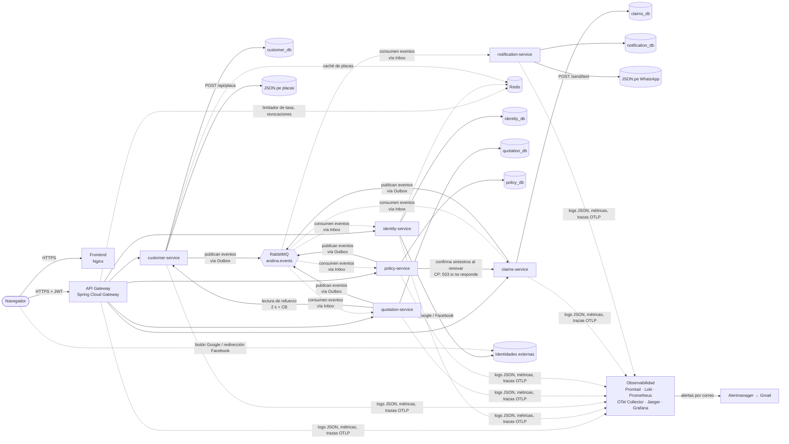
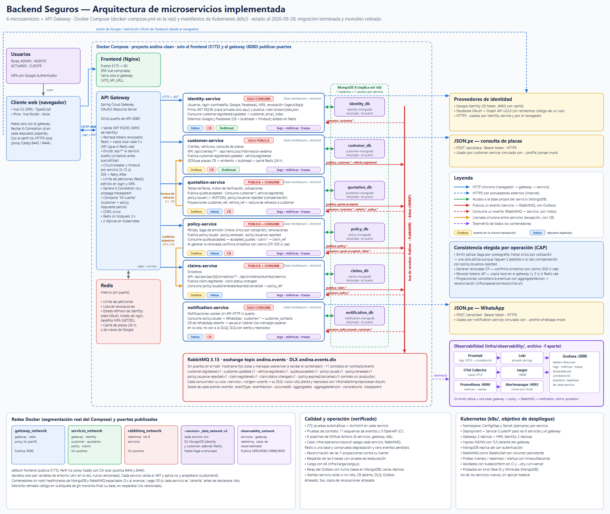

# Backend Seguros — Propuesta de migración a microservicios

Objetivo: convertir el sistema actual (un backend monolítico en capas Clean + un worker de notificaciones) en **microservicios reales**: cada servicio con su propio dominio, su propia base de datos y su propio despliegue, sin acceder nunca a los datos de otro.

Documentos relacionados: [ARQUITECTURA-ACTUAL.md](a_ARQUITECTURA-ACTUAL.md) (estado actual) y [ANALISIS-RIESGOS-ARQUITECTURA.md](b_ANALISIS-RIESGOS-ARQUITECTURA.md) (riesgos que esta migración debe resolver).

> **Decisiones confirmadas.** Se migra a **6 microservicios de negocio + 1 API Gateway** (sección 3.1), con **Redis**, observabilidad completa (**logs con correlationId, métricas y trazas con OpenTelemetry**, sección 7.2) y **Docker Compose** como orquestador por ahora. La sección 3.4 (variante de 4 servicios) queda solo como referencia descartada.

> **Estado (2026-09-28): propuesta implementada por completo.** Las 8 fases de la ruta están cerradas y el monolito se retiró del repositorio. El diagrama [c_DIAGRAMA-ARQUITECTURA-MICROSERVICIOS.svg](c_DIAGRAMA-ARQUITECTURA-MICROSERVICIOS.svg) ([PNG](c_DIAGRAMA-ARQUITECTURA-MICROSERVICIOS.png)) muestra la arquitectura **tal como quedó implementada**; se genera con `diagramas/generar-diagrama-microservicios.js`. Este documento conserva el diseño original. Donde la implementación se apartó, lo indica una nota **Implementado:**, y la [sección 13](#13-cómo-quedó-implementada-2026-09-28) resume todas las diferencias y sus motivos.

---

## 1. Punto de partida: acoplamientos que hay que romper

Lo que hoy es una llamada a un repositorio dentro del mismo proceso pasará a ser una llamada de red o un evento. Estos son los acoplamientos reales del código actual:

| Caso de uso actual | Datos de otros dominios que usa hoy | Problema al separar |
|---|---|---|
| `CrearCotizacionUseCase` | `ClienteRepository`, `VehiculoRepository`, `TablaTarifariaRepository` | Cotizar necesita cliente, vehículo y tarifas de tres dueños distintos |
| `EmitirPolizaUseCase` | `CotizacionRepository` (+ publica el evento) | La póliza depende del estado de una cotización ajena |
| `RegistrarSiniestroUseCase` | `PolizaRepository` | El siniestro exige una póliza vigente |
| `EvaluarRenovacionUseCase` | `PolizaRepository`, `SiniestroRepository`, `RenovacionRepository` | Renovar exige conocer los siniestros pendientes |
| `GenerarPolizaRenovadaUseCase` | `PolizaRepository`, `RenovacionRepository` | Crea una póliza a partir de una renovación |
| `ObtenerMiCuentaUseCase` | `UsuarioRepository`, `ClienteRepository`, `PolizaRepository`, `RenovacionRepository` | Compone datos de cuatro dominios |
| `AutenticarConGoogleUseCase` | `UsuarioRepository`, `ClienteRepository` | El login social exige saber si el correo es de un cliente |
| Consumer de notificaciones | Lee la colección `clientes` del backend | Acceso directo a la base de otro servicio |

Este listado es el mapa de trabajo: cada fila se resuelve con uno de los mecanismos de la sección 5.

---

## 2. Principios de la migración

1. **Un servicio, un dominio, una base de datos.** Ningún servicio lee ni escribe la base de otro. El consumer actual, que lee `clientes` directamente, deja de existir como práctica.
2. **Se comunican por contratos, no por datos compartidos.** Contratos = APIs REST versionadas y eventos versionados.
3. **Los datos de referencia se replican; los datos maestros no se comparten.** Cada servicio guarda una copia mínima (proyección) de lo que necesita de otros, alimentada por eventos.
4. **Consistencia eventual aceptada de forma explícita.** Donde el negocio no tolera retraso (por ejemplo, no emitir la misma cotización dos veces), se usa validación síncrona o una saga.
5. **Todo fallo de red se supone.** Cada llamada síncrona lleva timeout, circuit breaker y una decisión de qué hacer cuando falla.
6. **Migración gradual (patrón Strangler Fig).** El monolito sigue funcionando y se le van quitando dominios uno a uno; no hay reescritura total.
7. **Se corrigen las vulnerabilidades críticas antes de repartirlas** en varios servicios (registro con rol, falta de control por rol, secretos en el código). Ver sección 9, fase 0.

---

## 3. Descomposición propuesta

### 3.1 Servicios y responsabilidades

| Servicio | Contexto de negocio | Datos que posee (BD propia) | Endpoints actuales que asume |
|---|---|---|---|
| **identity-service** | Usuarios, autenticación, MFA, login social | `usuarios` (incluye MFA e identidades sociales) | `/api/auth/**`, `/api/mfa/**` |
| **customer-service** | Clientes y sus vehículos, consulta de placas | `clientes`, `vehiculos` | `/api/clientes/**`, `/api/vehiculos/informacion-externa` |
| **quotation-service** | Tarifas y cotizaciones (motor de tarificación) | `tablas_tarifarias`, `cotizaciones` | `/api/tablas-tarifarias/**`, `/api/cotizaciones/**` |
| **policy-service** | Pólizas y su ciclo de vida, renovaciones | `polizas`, `propuestas_renovacion` | `/api/polizas/**`, `/api/renovaciones/**` |
| **claims-service** | Siniestros | `siniestros` | `/api/polizas/{id}/siniestros/**` |
| **notification-service** | Notificaciones (hoy el consumer) | `processed_notification_events`, `customer_contacts` (proyección) | Ninguno (solo eventos) |
| **api-gateway** | Punto único de entrada | Ninguno (estado efímero en Redis) | Todas las rutas `/api/**` hacia los servicios |

Además siguen: **frontend** (Nginx) y la infraestructura compartida (RabbitMQ, MongoDB, Redis).

**Nota de enrutamiento:** la ruta de siniestros (`/api/polizas/{id}/siniestros/**`) cuelga del prefijo de pólizas, pero pertenece a claims-service. El gateway debe declarar esa ruta **antes** que `/api/polizas/**` (más específica primero) o, mejor a futuro, exponerla como `/api/siniestros?polizaId=…` (cambio que requeriría ajustar el frontend).

**Por qué estos cortes:**

- Las **renovaciones van dentro de policy-service** porque son parte del ciclo de vida de la póliza: la evalúan, la aprueban y generan la póliza renovada. Separarlas obligaría a un ida y vuelta constante entre servicios.
- **Tarifas y cotizaciones van juntas** porque cotizar consume las tarifas en cada operación; separarlas generaría una llamada síncrona por cada cotización.
- **Siniestros es un servicio aparte** porque tiene un ciclo de vida y un equipo de negocio distintos (registro y seguimiento), y solo necesita saber si la póliza existe y está vigente.
- **Identity está separado** porque todo el sistema depende de él y porque necesita ser el punto más protegido.

### 3.2 Ubicación de las clases actuales

| Paquete actual (`usecases/service/...`) | Servicio destino |
|---|---|
| `auth/*`, `mfa/*` | identity-service |
| `cliente/CrearCliente`, `ListarClientes`, `ObtenerCliente`; `vehiculo/*`; `ConsultarInformacionVehiculoService`; adaptadores `jsonpe` | customer-service |
| `tarifa/*`, `cotizacion/*`; `MotorDeTarificacion`, `FactorRiesgo`, `TablaTarifaria`, `ResultadoTarificacion` | quotation-service |
| `poliza/*`, `renovacion/*`; `EvaluadorRenovacion`, `CalculadorPrimaRenovacion`, `PoliticaVariacionPrima`, `PropuestaRenovacion` | policy-service |
| `siniestro/*`, `Siniestro` | claims-service |
| `notification-consumer` | notification-service (evoluciona) |
| `cliente/ObtenerMiCuenta` | api-gateway (composición de respuestas) |

Cada servicio conserva la **misma organización Clean Architecture** (`entities`, `usecases`, `interfaceadapters`, `frameworksdrivers`) y su propia prueba ArchUnit. Los enums y value objects que necesiten dos servicios (por ejemplo `Dinero`, `Placa`) **se duplican a propósito**: compartir una librería de dominio recrearía el acoplamiento del monolito. Lo único compartido será el módulo de contratos (sección 8).

### 3.3 Arquitectura objetivo



Reglas de la figura: solo el gateway recibe tráfico externo; cada flecha a una base de datos es exclusiva de su servicio; los servicios no se llaman entre sí salvo en los casos síncronos justificados de la sección 5.4. **Implementado:** quotation → customer y, desde la fase 7, policy → claims al generar una renovación. Por eventos: **customer** solo publica; **identity** y **notification** solo consumen; **quotation**, **policy** y **claims** publican y consumen. El diagrama completo, con puertos, redes y Docker Compose, está en [c_DIAGRAMA-ARQUITECTURA-MICROSERVICIOS.svg](c_DIAGRAMA-ARQUITECTURA-MICROSERVICIOS.svg).

### 3.4 Variante mínima: 4 servicios

Si 6 servicios es demasiado para el alcance del trabajo, agrupa así (los mecanismos de las secciones 5 a 7 no cambian):

| Servicio | Contiene |
|---|---|
| identity-service | Usuarios, auth, MFA |
| customer-service | Clientes, vehículos, placas |
| insurance-service | Tarifas, cotizaciones, pólizas, renovaciones, siniestros |
| notification-service | Consumer actual |

Con esta variante, `Cotización → Póliza → Siniestro → Renovación` sigue dentro de un mismo proceso y una misma base, por lo que **no hace falta ninguna saga** entre ellos. Es más simple de operar, pero repite un monolito más pequeño; solo sirve como paso intermedio hacia los 6 servicios.

---

## 4. Contratos de eventos

Se mantiene RabbitMQ. Se propone **un exchange `topic` único, `andina.events`**, con claves de enrutamiento de la forma `<contexto>.<evento>.v<versión>`. El evento que ya existe conserva su clave de enrutamiento y su contenido (`policy.issued.v1`, tipo `PolicyIssued`) para no romper al consumidor. Como hoy se publica en el exchange `andina.insurance.events`, durante la transición (fase 1 en adelante) se enlazan **ambos exchanges** a las mismas colas; cuando todos los servicios usen `andina.events`, se retira el antiguo.

| Evento (routing key) | Publica | Consumen | Datos clave (payload) |
|---|---|---|---|
| `customer.registered.v1` | customer | notification, quotation, identity | `customerId`, `documento`, `nombre`, `email`, `telefono` |
| `customer.updated.v1` | customer | notification, quotation, identity | ídem, con los campos cambiados |
| `vehicle.registered.v1` | customer | quotation | `vehicleId`, `customerId`, `placa`, `tipo`, `uso`, `anio`, `valor` |
| `quote.accepted.v1` | quotation | policy | `quoteId`, `customerId`, `vehicleId`, `prima`, `cobertura`, `vigencia`, `tablaTarifariaId` |
| `policy.issued.v1` | policy | quotation, claims, notification (y un consumidor de auditoría, opcional; no aparece en el diagrama) | `policyId`, `quoteId`, `customerId`, `policyNumber`, `vigencia` |
| `policy.renewed.v1` | policy | claims, notification | `newPolicyId`, `previousPolicyId`, `customerId`, `vigencia` |
| `policy.expired.v1` / `policy.cancelled.v1` | policy | claims | `policyId`, `motivo` |
| `claim.registered.v1` | claims | policy | `claimId`, `policyId`, `estado` |
| `claim.status-changed.v1` | claims | policy, notification | `claimId`, `policyId`, `estadoAnterior`, `estadoNuevo` |

Reglas de los eventos:

- **Eventos "gordos" con lo que el consumidor necesita** (no solo un identificador), para evitar que cada consumidor vuelva a llamar al emisor.
- Todos llevan el sobre estándar que ya existe: `eventId`, `eventType`, `eventVersion`, `occurredAt`, `aggregateId`, `data`. Se añaden `correlationId`, `traceparent` (contexto de OpenTelemetry) y `producer`.
- **Cambios compatibles hacia atrás** (solo agregar campos opcionales). Un cambio incompatible crea `…v2` y se publican ambas versiones durante la transición.
- **Cada consumidor tiene su propia cola** (`<servicio>.<origen>.<evento>`), con su DLQ y una cola de reintento con espera. No se comparten colas entre servicios.

---

## 5. Sincronización de datos

Hay cuatro mecanismos. La regla es: **eventos y proyecciones por defecto; llamada síncrona solo cuando el negocio exige el dato actualizado en el momento.**

### 5.1 Mecanismo A: eventos + proyección local (el principal)

Cada servicio guarda una copia mínima, de solo lectura, de los datos ajenos que necesita, y la mantiene con los eventos del catálogo anterior.

| Servicio que necesita | Dato ajeno | Fuente | Se guarda como | Sustituye a |
|---|---|---|---|---|
| notification | Teléfono y nombre del cliente | `customer.registered/updated` | `customer_contacts` | Lectura directa de `clientes` |
| quotation | Cliente y vehículo (validar que existen y sus atributos) | `customer.*`, `vehicle.registered` | `customer_ref`, `vehicle_ref` | `ClienteRepository`, `VehiculoRepository` |
| policy | Cotización aceptada (para emitir la póliza) | `quote.accepted` | `accepted_quotes` | `CotizacionRepository` |
| claims | Póliza (existencia y vigencia) | `policy.issued/renewed/expired/cancelled` | `policy_ref` | `PolizaRepository` |
| policy | Siniestros abiertos por póliza (bloquean renovar) | `claim.registered/status-changed` | `open_claims_by_policy` (contador). **Implementado:** proyección `claim_ref` (un documento por siniestro) y, al generar la póliza renovada, confirmación síncrona con claims-service (sección 13) | `SiniestroRepository` |
| identity | Correos de clientes (para decidir el acceso de un CLIENTE) | `customer.*` | `customer_email_index` | `ClienteRepository` |

Condiciones para que funcione:

- **Backfill inicial:** al crear una proyección hay que cargarla con los datos que ya existen (un evento de "snapshot" o un endpoint de exportación en el servicio dueño).
- **Orden y duplicados:** los consumidores deben tolerar mensajes repetidos y desordenados. Cada evento lleva una `version` del agregado y el consumidor descarta versiones más viejas que la que ya tiene.
- **Reconciliación periódica:** un trabajo nocturno compara conteos o hashes entre la proyección y la fuente, y reporta diferencias.

### 5.2 Mecanismo B: Outbox transaccional (publicar sin perder eventos)

Esto **corrige el riesgo A1** del análisis (póliza guardada pero sin evento publicado). En cada servicio que publica eventos:

1. En la **misma transacción** que guarda el cambio de negocio se inserta el evento en una colección `outbox`.
2. Un proceso en segundo plano (relay) lee la colección, publica en RabbitMQ con confirmación (`publisher confirms`) y marca el evento como enviado.
3. Si RabbitMQ está caído, el evento espera en el `outbox`; nada se pierde, y hay que monitorizar la antigüedad del evento pendiente más viejo.

Nota técnica: las transacciones multi-documento de MongoDB requieren un **replica set**, aunque sea de un solo nodo en desarrollo. Alternativa sin transacciones: escribir el evento como un campo dentro del mismo documento del agregado y que el relay lo saque de ahí.

### 5.3 Mecanismo C: Inbox / idempotencia del consumidor

Es lo que hoy hace el consumer con `processed_notification_events`, generalizado a todos los servicios:

- Cada consumidor registra el `eventId` procesado en una colección `inbox` (con índice único) **en la misma transacción** que aplica el efecto.
- Si el evento llega repetido, se confirma (ACK) sin repetir el efecto.
- Los efectos externos que no se pueden deshacer (enviar un WhatsApp) llevan además una clave de idempotencia hacia el proveedor cuando este la admite.

### 5.4 Mecanismo D: llamada síncrona con circuit breaker (excepción, no regla)

Solo cuando el dato debe estar al día en el instante de la operación y una proyección no basta:

| Llamada | Motivo | Comportamiento si el destino falla |
|---|---|---|
| quotation → customer (`GET /clientes/{id}/vehiculos/{id}`), solo si falta en la proyección (*read-through*) | El cliente pudo registrarse hace segundos y el evento no ha llegado | Responder `503` con mensaje claro ("no se puede validar el cliente ahora, reintenta") |
| gateway → varios servicios para "Mi cuenta" | Componer una vista de identidad, cliente, pólizas y renovaciones | Respuesta parcial: devolver lo disponible y marcar las secciones no disponibles |

### 5.5 Consistencia entre servicios: sagas

Las operaciones que tocan varios servicios no pueden usar una transacción única. Se definen como sagas de **coreografía** (cada servicio reacciona a eventos; no hay un orquestador central), suficiente para este tamaño.

**Saga de emisión de póliza**

```
quotation-service : quote.accepted.v1  ─────────────────────────────►  policy-service
                                                                          │ valida contra accepted_quotes
                                                                          │ crea la póliza (VIGENTE)
                                                                          ▼
quotation-service  ◄──────────  policy.issued.v1  ──────────►  claims-service (policy_ref)
   marca la cotización EMITIDA                    └────────►  notification-service (WhatsApp)
```

- **Paso que puede fallar:** policy-service rechaza la cotización (ya vencida o ya emitida). Compensación: publica `policy.issuance-rejected.v1` y quotation devuelve la cotización a "ACEPTADA" con el motivo.
- **Protección contra doble emisión:** policy-service guarda un índice único por `quoteId`; una segunda emisión de la misma cotización se rechaza aunque llegue simultáneamente desde dos réplicas.

**Saga de renovación:** vive casi entera dentro de policy-service (evaluar, aprobar, generar). La única dependencia externa es el contador de siniestros abiertos (`open_claims_by_policy`). Si el contador estuviera desactualizado, la evaluación falla por seguridad (se trata como "hay pendientes") y se reintenta. **Implementado:** además, al generar la póliza renovada (el paso irreversible), policy confirma los siniestros con claims-service. Si claims no responde, devuelve 503 `SINIESTROS_NO_DISPONIBLE` (decisión CP, `n_…` sección 10.1).

---

## 6. Resiliencia

### 6.1 Circuit breaker y patrones acompañantes

Se usa **Resilience4j** (integra con Spring Boot y con Spring Cloud Gateway). Un circuit breaker aislado no basta; se combinan estos patrones:

| Patrón | Para qué | Dónde |
|---|---|---|
| **Timeout** | Que ninguna llamada espere indefinidamente | En toda llamada saliente (HTTP, Mongo, AMQP) |
| **Circuit breaker** | Dejar de llamar a un destino que está fallando para que se recupere y no se agoten hilos | Ver tabla siguiente |
| **Retry con backoff exponencial y jitter** | Absorber fallos breves | Solo operaciones idempotentes (GET, o POST con clave de idempotencia) |
| **Bulkhead** | Aislar recursos: un destino lento no consume todos los hilos | Llamadas a JSON.pe, Google y Facebook |
| **Rate limiter** | Proteger de picos y de fuerza bruta | Gateway (por IP y por usuario) y `login` |
| **Fallback** | Devolver algo útil cuando la llamada falla | Caché, respuesta parcial o error controlado |
| **Cache** | Reducir llamadas y sostener el servicio si el proveedor cae | Consulta de placas, claves públicas de Google |

### 6.2 Dónde se aplica cada uno

| Llamada | Timeout | Circuit breaker | Reintentos | Fallback |
|---|---|---|---|---|
| Gateway → servicio interno | 3 s. **Implementado:** un valor por servicio, de 3 s en claims a 12 s en identity y customer, según lo que tarda cada operación | Sí, uno por servicio | No en POST/PATCH; 1 en GET | `503` con `Retry-After` y mensaje uniforme |
| customer → JSON.pe (placas) | 5 s (ya existe) | Sí | 1, con jitter | Caché de placas consultadas (TTL 24 h); si no hay, permitir ingreso manual de los datos del vehículo |
| identity → Google (verificar ID token) | 3 s | Sí | 1 | Caché de las claves públicas de Google; si caen, rechazar el login social y ofrecer contraseña |
| identity → Facebook Graph | 5 s | Sí | **No** (el código OAuth es de un solo uso) | Mensaje de error y login por contraseña |
| notification → JSON.pe WhatsApp | 5 s (ya existe) | Sí | Ya existe (4 con backoff) | **Ver 6.3** |
| quotation → customer (read-through) | 2 s | Sí | 1 en GET | `503` controlado (5.4) |
| Servicios → MongoDB | `serverSelectionTimeout` corto | No (lo cubre el driver y los healthchecks) | Del driver | Servicio no listo → el gateway lo saca de rotación |
| Servicios → RabbitMQ (publicar) | Confirmación con timeout | No | El relay del Outbox reintenta | El evento permanece en el Outbox |

Configuración de ejemplo (Resilience4j en `application.yml` de customer-service):

```yaml
resilience4j:
  circuitbreaker:
    instances:
      jsonpe:
        slidingWindowType: COUNT_BASED
        slidingWindowSize: 20
        minimumNumberOfCalls: 10
        failureRateThreshold: 50
        slowCallDurationThreshold: 4s
        slowCallRateThreshold: 80
        waitDurationInOpenState: 30s
        permittedNumberOfCallsInHalfOpenState: 3
        automaticTransitionFromOpenToHalfOpenEnabled: true
  retry:
    instances:
      jsonpe:
        maxAttempts: 2
        waitDuration: 500ms
        enableExponentialBackoff: true
        exponentialBackoffMultiplier: 2
        enableRandomizedWait: true
  bulkhead:
    instances:
      jsonpe:
        maxConcurrentCalls: 10
        maxWaitDuration: 0
```

Los estados del circuit breaker (abierto, semiabierto, cerrado) se exponen como métricas para poder alertar cuando uno se abre.

### 6.3 Resiliencia en mensajería (el circuit breaker HTTP no aplica igual)

En un consumidor de mensajes, "abrir el circuito" significa **dejar de consumir**, no responder un error:

- Si el circuit breaker de WhatsApp se abre, notification-service **pausa el listener** (o rechaza con espera a una cola de reintento con TTL), en lugar de quemar los 4 reintentos de cada mensaje y enviarlos a la DLQ.
- Cuando el circuito pasa a semiabierto, reanuda el consumo con un mensaje de prueba.
- **La DLQ deja de ser un cementerio:** se añade una alerta por su tamaño y un proceso documentado de reproceso (mover mensajes de vuelta a la cola principal). Esto cubre el riesgo A6 del análisis.
- Canal alternativo opcional: correo electrónico si WhatsApp está caído más de X minutos.

### 6.4 Otras defensas

- **Health checks separados:** *liveness* (el proceso responde) y *readiness* (puede atender: Mongo y RabbitMQ accesibles). Docker y el gateway usan *readiness* para dirigir tráfico.
- **Apagado ordenado:** los consumidores terminan el mensaje en curso antes de detenerse.
- **Degradación planificada:** definir por servicio qué funciona si otro cae (ejemplo: si claims cae, se puede emitir y renovar pólizas; si notification cae, todo funciona salvo el WhatsApp).

---

## 7. Componentes que hay que agregar

| Componente | Función | Tecnología propuesta | Prioridad |
|---|---|---|---|
| **API Gateway** | Único punto de entrada; enrutamiento; validación de JWT; CORS único; rate limiting; correlación de peticiones; circuit breaker hacia cada servicio | Spring Cloud Gateway | Imprescindible |
| **Autenticación entre servicios** | Que un servicio no acepte tráfico sin identidad válida | JWT firmado con **RS256**; identity publica las claves en un endpoint JWKS; cada servicio valida con la clave pública. Para llamadas entre servicios, token de servicio (client credentials) | Imprescindible |
| **Base de datos por servicio** | Aislamiento de datos | MongoDB: una instancia con **una base y un usuario por servicio** en desarrollo; instancias separadas en producción | Imprescindible |
| **Outbox e Inbox** | Publicación y consumo confiables | Colecciones `outbox` e `inbox` en cada servicio | Imprescindible |
| **Contratos versionados** | Evitar que un cambio rompa a otro servicio | Módulo `contracts/` con OpenAPI y esquemas de eventos; pruebas de contrato (Spring Cloud Contract o Pact) | Imprescindible |
| **Observabilidad** | Ver qué ocurre entre servicios | Logs JSON con `correlationId` (Promtail + Loki); métricas con Micrometer + Prometheus; trazas con OpenTelemetry (OTel Collector + Jaeger); todo en Grafana. Detalle en 7.2 | Imprescindible |
| **Redis** | Estado efímero compartido (state OAuth, tickets de login, desafíos MFA), contadores de rate limit y caché | Redis | Alta (resuelve el riesgo A3) |
| **Gestión de secretos** | Sacar tokens y claves del código | Variables de entorno desde `.env` (mínimo); Docker secrets o Vault | Imprescindible (riesgo S3) |
| **Configuración** | Evitar `application.yml` con valores fijos | Perfiles de Spring + variables de entorno; Spring Cloud Config solo si crecen los servicios | Media |
| **Descubrimiento de servicios** | Que los servicios se encuentren | El DNS interno de Docker Compose (o de Kubernetes) basta; **no** hace falta Eureka | Baja |
| **Trazabilidad de eventos** | Auditar y reprocesar | Consumidor de auditoría real para `audit.queue` (hoy sin consumidor) | Media |
| **CI/CD por servicio** | Construir y probar cada servicio por separado | Pipeline por servicio; build de imágenes versionadas | Alta |
| **Pruebas de integración de extremo a extremo** | Verificar sagas y proyecciones | Testcontainers (Mongo y RabbitMQ) | Alta |
| **Balanceo y TLS** | Cifrado hacia afuera | Proxy inverso con HTTPS delante del gateway y del frontend | Imprescindible fuera de local |

### 7.1 Cambios de seguridad que trae la arquitectura

- **Cambio del JWT de HS256 a RS256.** Hoy el secreto simétrico permite firmar y verificar. Si lo conocen 6 servicios, el robo de uno compromete a todos. Con RS256 solo identity firma y los demás verifican con la clave pública.
- **Doble validación:** el gateway valida el token y **cada servicio vuelve a validar** (defensa en profundidad), aplicando roles y propiedad del recurso. Esto corrige S1 y S2, que en un sistema distribuido serían más graves.
- **Claims útiles en el token:** `sub`, `roles`, `customerId` (para que claims y policy filtren por propietario sin consultar a identity).
- **Segmentación de redes Docker:** `edge` (frontend y gateway), `services` (gateway y servicios), `data` (servicios, MongoDB y Redis), `messaging` (servicios y RabbitMQ) y `observability` (servicios, gateway y el stack de observabilidad). Solo el gateway, el frontend y Grafana publican puertos en el host. **Implementado:** las redes son `gateway_network`, `services_network`, `rabbitmq_network`, una `<servicio>_data_network` por servicio (con su MongoDB) y `observability_network`. En local también publican puerto Prometheus, Jaeger y Alertmanager.

### 7.2 Observabilidad (decidida): logs con correlationId, métricas y trazas con OpenTelemetry

Tres señales, una herramienta para cada una y Grafana como punto de consulta. Corre en un archivo aparte (**implementado:** `infra/observability/docker-compose.observability.yml`) para poder levantar el sistema con o sin él.

| Señal | Cómo se produce | Recolección | Almacén | Consulta |
|---|---|---|---|---|
| **Logs** | JSON a la salida estándar de cada contenedor, con `timestamp`, `level`, `service`, `correlationId`, `traceId`, `spanId` y `userId` | Promtail lee los logs de Docker | Loki | Grafana (Explore) |
| **Métricas** | Micrometer en cada servicio y en el gateway, expuestas en `/actuator/prometheus` | Prometheus hace *scrape* cada 15 s | Prometheus | Grafana (paneles y alertas) |
| **Trazas** | SDK o agente de OpenTelemetry para Java, exportando por OTLP | OTel Collector | Jaeger | Jaeger UI y Grafana |

**Correlation ID (cómo funciona):**

1. El **gateway** genera un `X-Correlation-Id` (UUID) si la petición no lo trae y lo reenvía a cada servicio. También devuelve el mismo valor en la respuesta, para que soporte pueda pedírselo al usuario.
2. Cada servicio lo guarda en el MDC del log, así aparece en todas sus líneas de log.
3. Al **publicar un evento**, el servicio copia el `correlationId` y el `traceparent` al sobre del mensaje (ya previsto en la sección 4). El consumidor los restaura antes de procesar. Así el hilo no se rompe entre HTTP y RabbitMQ.
4. En las llamadas salientes (por ejemplo a JSON.pe) el identificador viaja en el encabezado cuando el proveedor lo admite.

**Trazas:** el contexto W3C `traceparent` se propaga por HTTP y por los mensajes de RabbitMQ. Un solo `traceId` recorre: gateway → policy-service → Outbox → RabbitMQ → notification-service → WhatsApp. El `traceId` se imprime en los logs, de modo que desde una traza se salta a sus logs y viceversa.

**Métricas mínimas por servicio:**

| Categoría | Métricas |
|---|---|
| HTTP | Tasa de peticiones, latencia (p50, p95, p99) y errores 4xx/5xx por ruta |
| Circuit breaker | Estado (cerrado, abierto, semiabierto) y tasa de fallos por instancia |
| Mensajería | Antigüedad del evento más viejo en el Outbox, mensajes en cola, tamaño de la DLQ, tiempo de procesamiento y reintentos |
| Negocio | Pólizas emitidas, cotizaciones aceptadas, notificaciones enviadas y fallidas |
| Infraestructura | Estado de MongoDB, RabbitMQ y Redis; JVM (memoria, hilos, GC) |

**Alertas iniciales:** circuit breaker abierto más de 2 minutos; DLQ con mensajes; Outbox con eventos pendientes de más de 5 minutos; tasa de errores 5xx superior al 5 %; servicio sin *readiness*. **Implementado:** todas, más "notificaciones pausadas" y "copia de revocaciones atrasada". Alertmanager las envía por correo (`n_…` sección 11).

**Puertos locales:** Grafana 3000, Jaeger UI 16686, Prometheus 9090. Loki y el OTel Collector quedan solo en la red interna `observability`.

---

## 8. Estructura del repositorio y del despliegue

```
andina-seguros/
├── contracts/                 # OpenAPI + esquemas JSON de eventos (versionados)
├── gateway/
├── services/
│   ├── identity-service/      # cada uno con entities / usecases /
│   ├── customer-service/      #   interfaceadapters / frameworksdrivers
│   ├── quotation-service/
│   ├── policy-service/
│   ├── claims-service/
│   └── notification-service/
├── frontend/
└── infra/
    ├── docker-compose.yml           # stack completo
    ├── docker-compose.observability.yml
    └── mongo-init/                  # crea una base y un usuario por servicio
```

Servicios del `docker-compose.yml` objetivo:

| Servicio | Puerto en el host | Redes |
|---|---|---|
| frontend | 5173 | edge |
| gateway | 8080 (único puerto de API expuesto) | edge, services |
| identity / customer / quotation / policy / claims | ninguno | services, data, messaging |
| notification | ninguno | data, messaging |
| mongodb | ninguno en producción (solo local si hace falta) | data |
| rabbitmq | ninguno (consola solo por túnel o red interna) | messaging |
| redis | ninguno | data |
| otel-collector, prometheus, loki, promtail, jaeger | ninguno (solo Jaeger UI 16686 y Prometheus 9090 en local) | observability |
| grafana | 3000 | observability |

**Orquestador:** Docker Compose por ahora (`docker-compose.yml` + `docker-compose.observability.yml`), con `depends_on` y *healthchecks* en este orden: MongoDB, RabbitMQ y Redis → servicios → gateway → frontend. Si más adelante se necesitan réplicas, autoescalado o despliegues sin corte, el siguiente paso natural es Kubernetes; los servicios ya quedan preparados (sin estado, con *readiness*, configuración por entorno).

El frontend cambia su `VITE_API_URL` para apuntar al gateway (`http://localhost:8080/api`); no llama a ningún servicio directamente.

**Implementado (estructura real del repositorio):**

```
├── docker-compose.yml, docker-compose.debug.yml, .env.example   # stack completo, en la raíz
├── contracts/            # 11 esquemas de eventos + 5 OpenAPI, verificados en CI
├── gateway/
├── services/<6 servicios>/   # Clean Architecture + ArchUnit; migracion/ (scripts históricos)
├── frontend/
├── infra/
│   ├── mongo/            # arranque con replica set y usuarios, respaldo y prueba de restauración
│   ├── rabbitmq/         # plugins y reproceso de DLQ
│   ├── observability/    # Compose aparte: Prometheus (alertas), Alertmanager, Loki, Promtail, Grafana, OTel
│   ├── operacion/        # caos.sh y reconciliar.sh
│   ├── carga/            # prueba de carga k6
│   └── tls/              # proxy HTTPS local (perfil tls)
├── k8s/                  # manifiestos (validados con kubeconform)
└── .github/workflows/    # 8 pipelines
```

En lugar de una instancia de MongoDB con una base por servicio, cada servicio tiene **su propia instancia** (replica set de un nodo con autenticación). Así el aislamiento no depende solo de los permisos.

---

## 9. Plan de migración por fases (Strangler Fig)

El orden va del servicio menos acoplado al más acoplado, y en cada fase el sistema sigue funcionando.

| Fase | Trabajo | Resultado verificable |
|---|---|---|
| **0. Preparación** | Cerrar S1 y S2 (registro con rol y control de acceso), sacar secretos del código y rotarlos, autenticar MongoDB y RabbitMQ. Añadir Outbox al backend actual. Añadir `correlationId`, métricas y trazas. Poner el **gateway delante del monolito** (todo sigue pasando por él, sin cambiar nada más). Crear el módulo `contracts/`. | El monolito es seguro, publica eventos sin pérdida y ya se accede a través del gateway |
| **1. notification-service** | Añadir `customer.registered/updated` al monolito. Crear la proyección `customer_contacts` en notification y **dejar de leer la colección `clientes`**. Añadir circuit breaker y pausa del listener. | El consumer no tiene acceso a la base del backend |
| **2. identity-service** | Mover `usuarios`, auth y MFA. Pasar a RS256 con JWKS. Mover el estado en memoria a Redis. Publicar/consumir eventos de clientes para el índice de correos. El gateway enruta `/api/auth/**` y `/api/mfa/**` al nuevo servicio. | Login, Google, Facebook y MFA funcionan desde el servicio nuevo y con varias réplicas |
| **3. customer-service** | Mover `clientes`, `vehiculos` y la consulta de placas (con circuit breaker, caché y bulkhead). Publicar `customer.*` y `vehicle.registered`. Migrar datos y hacer backfill de las proyecciones. | El monolito ya no tiene clientes ni vehículos |
| **4. claims-service** | Mover `siniestros`. Crear `policy_ref` (proyección de pólizas) y publicar `claim.*`. Mientras la póliza siga en el monolito, este publica `policy.*`. | Los siniestros se registran sin acceder a la base de pólizas |
| **5. quotation-service** | Mover tarifas, cotizaciones y el motor de tarificación. Crear `customer_ref` y `vehicle_ref`. Publicar `quote.accepted`. | Se puede cotizar con customer-service caído (usando las proyecciones) |
| **6. policy-service** | Mover pólizas y renovaciones. Crear `accepted_quotes` y `open_claims_by_policy`. Activar la saga de emisión con su compensación. **El monolito se apaga.** | Emitir y renovar funciona solo con eventos; el monolito ya no existe |
| **7. Endurecimiento** | Pruebas de caos (apagar servicios), reproceso de DLQ, alertas, pruebas de contrato en CI, prueba de carga, revisión de seguridad completa. | Las degradaciones planificadas de 6.4 se comprueban en la práctica |

**Cómo se migran los datos en cada fase:**

1. El servicio nuevo nace con su base vacía y una copia de solo lectura del monolito (backfill).
2. Se activa la **doble escritura controlada**: el monolito sigue siendo la fuente y publica eventos; el servicio nuevo los aplica y se compara.
3. Cuando ambos coinciden durante un periodo de prueba, el gateway **cambia la ruta** hacia el servicio nuevo (el monolito queda sin ese endpoint).
4. Se conserva un **plan de reversa**: volver a apuntar la ruta del gateway al monolito mientras sus datos no se hayan borrado.

---

## 10. Desventajas y riesgos de migrar

Migrar cuesta. Conviene asumir estos costos con conciencia:

| Costo | Explicación |
|---|---|
| **Complejidad operativa** | De 3 procesos se pasa a unos 9 (6 servicios, gateway, frontend) más MongoDB, RabbitMQ y Redis, con observabilidad indispensable. |
| **Consistencia eventual** | Una proyección puede ir unos segundos por detrás. Hay que diseñar la interfaz para tolerarlo (por ejemplo, el cliente recién creado tarda en aparecer para cotizar). |
| **Depuración más difícil** | Un error puede cruzar cuatro servicios; sin `correlationId` y trazas distribuidas es casi imposible seguirlo. |
| **Más pruebas** | Las pruebas de contrato y de integración pasan a ser obligatorias. |
| **Riesgo de "monolito distribuido"** | Si los servicios se llaman entre sí de forma síncrona en cadena, se obtiene lo peor de ambos mundos. La regla de la sección 5 (eventos primero) lo evita. |
| **Duplicación de código** | Los value objects se repiten por servicio a propósito. Es un costo aceptado. |
| **Más superficie de ataque** | Más servicios, más puntos de entrada internos; de ahí la doble validación y la segmentación de redes. |

**Alternativa a considerar:** si el equipo es pequeño y el volumen bajo, un **monolito modular** (mismo despliegue, módulos aislados y comunicación por eventos internos) obtiene parte del beneficio con mucho menos costo, y deja la puerta abierta a extraer servicios después. La variante de 4 servicios de la sección 3.4 es un punto medio. Esta propuesta asume que el objetivo del proyecto es precisamente practicar la arquitectura de microservicios.

---

## 11. Criterios de aceptación (definición de "terminado")

La migración se considera completa cuando se cumple todo esto. **Estado (2026-09-28): todos cumplidos** (evidencias en `n_…`, sección 4):

- [x] Cada servicio tiene **su propia base de datos** y ninguna consulta cruza a otra base (verificable por credenciales: cada usuario de Mongo solo accede a su base). *(Una instancia de MongoDB por servicio, en su propia red; cada usuario solo accede a su base.)*
- [x] No existe ningún acceso directo del consumer a `clientes`; notification funciona solo con su proyección. *(Fase 1: proyección `customer_contacts`.)*
- [x] Todo evento se publica mediante **Outbox** y todo consumidor usa **Inbox**; apagar RabbitMQ durante una emisión no pierde ningún evento. *(Caso de caos `rabbitmq`: 0 eventos perdidos.)*
- [x] Toda llamada síncrona entre componentes tiene **timeout, circuit breaker y fallback documentado**; se comprobó apagando el destino. *(Casos de caos por servicio: 503 con `Retry-After` y degradación planificada.)*
- [x] Con el circuit breaker de WhatsApp abierto, los mensajes **no llegan a la DLQ**: se retienen y se envían al recuperarse. *(Fase 1 y caso de caos `whatsapp`.)*
- [x] El sistema funciona con **2 réplicas** de cada servicio (sin estado en memoria). *(Relay del Outbox con turno; caso de caos `replicas`.)*
- [x] El JWT se firma con **RS256**; solo identity posee la clave privada. *(Fase 2.)*
- [x] Ningún servicio expone puertos al host salvo el gateway y el frontend; la consola de RabbitMQ y MongoDB no son accesibles desde fuera. *(Solo 5173 y 8080; el resto, con `docker-compose.debug.yml` o el Compose de observabilidad.)*
- [x] Existen **pruebas de contrato** para cada API y cada evento, ejecutadas en CI. *(JSON Schema y OpenAPI, obligatorias en CI.)*
- [x] Una petición de "emitir póliza" se puede **seguir de punta a punta con un solo `correlationId`** en logs y trazas. *(Una traza en Jaeger y el mismo `correlationId` en Loki.)*
- [x] Los hallazgos S1 a S11 y A1 a A6 de [ANALISIS-RIESGOS-ARQUITECTURA.md](b_ANALISIS-RIESGOS-ARQUITECTURA.md) están resueltos o tienen una decisión documentada. *(`n_…` sección 5.)*

---

## 12. Decisiones tomadas

| Tema | Decisión |
|---|---|
| Número de servicios | **6 microservicios** (identity, customer, quotation, policy, claims, notification) + API Gateway |
| Broker y base de datos | Se mantienen **RabbitMQ** y **MongoDB**; MongoDB pasa a *replica set* para el Outbox transaccional |
| Estado compartido | **Redis** (rate limit, estado efímero de identity, caché) |
| Observabilidad | Logs JSON con **correlationId**, **métricas** (Micrometer + Prometheus) y **trazas con OpenTelemetry** (Collector + Jaeger), consultables en Grafana |
| Orquestación | **Docker Compose** por ahora; Kubernetes queda como evolución futura. **Implementado:** manifiestos completos en `k8s/`, validados en CI, sin aplicar a un clúster |
| Consistencia por operación (fase 7) | Renovar: **CP** (confirma con claims). Revocación de tokens: **AP** (copia local en el gateway). Resto: consistencia eventual con reconciliación |
| Alertas | Alertmanager con correo (Gmail) |
| Monolito | Retirado del repositorio el 2026-09-28 (etiqueta `monolito-final`, [q_RETIRO-DEL-MONOLITO.md](q_RETIRO-DEL-MONOLITO.md)) |

**Pendiente de decidir más adelante:** almacén de trazas definitivo si el volumen crece (Jaeger o Tempo) y estrategia de despliegue continuo por servicio.

---

## 13. Cómo quedó implementada (2026-09-28)

La arquitectura de las secciones 3 a 8 se construyó en las fases 0 a 7 de la [ruta](d_RUTA-IMPLEMENTACION-MICROSERVICIOS.md). Cada fase tiene su documento (`e_` a `n_`) con lo que se hizo, las decisiones, los **errores encontrados y cómo se resolvieron** y la verificación. El retiro del monolito está en [q_RETIRO-DEL-MONOLITO.md](q_RETIRO-DEL-MONOLITO.md).



### 13.1 Lo que se implementó como se propuso

- 6 microservicios + API Gateway, cada uno con Clean Architecture y su prueba ArchUnit.
- Una base por servicio, sin lecturas cruzadas. Los datos ajenos se copian en proyecciones con `aggregateVersion`.
- Outbox transaccional (MongoDB en replica set), inbox e idempotencia, y una cola con DLQ por consumidor.
- Un exchange único, `andina.events`; el heredado se retiró en el paso 6.11.
- Saga de emisión por coreografía, con compensación (`policy.issuance-rejected`) e índice único por cotización.
- JWT RS256 con JWKS y doble validación: el gateway valida el token, y cada servicio vuelve a validarlo y aplica rol y propietario.
- Resilience4j:
  - timeout y circuit breaker;
  - reintentos solo en operaciones idempotentes;
  - bulkhead hacia JSON.pe, Google y Facebook;
  - caché de placas y de claves de Google.
- notification-service pausa el listener cuando el circuito de WhatsApp está abierto.
- Observabilidad: logs JSON con `correlationId`, métricas y trazas OpenTelemetry que atraviesan RabbitMQ.
- Redis para el estado efímero y el límite de peticiones.
- Solo el gateway y el frontend publican puertos.

### 13.2 Diferencias con la propuesta y por qué

| Propuesta | Implementado | Por qué |
|---|---|---|
| Una instancia de MongoDB con una base y un usuario por servicio | **Una instancia por servicio**, cada una en su propia red | Aislamiento real: ningún servicio puede siquiera resolver el nombre de otra base |
| `open_claims_by_policy` (contador) para bloquear renovaciones | Proyección `claim_ref` (un documento por siniestro) + **confirmación síncrona con claims** al generar la póliza renovada | Un contador no se puede reconciliar ni corregir por siniestro. Además, renovar mal es un error de dinero: se eligió CP en el paso irreversible (`n_…` 10.1) |
| Revocación de tokens (no estaba en la propuesta) | Lista en Redis + **copia local en el gateway**, refrescada cada 5 s | Con Redis caído, rechazar todo habría convertido a Redis en un punto único de fallo; aceptar todo habría dejado pasar tokens revocados. Se eligió AP acotado (`n_…` 10.2) |
| Timeout del gateway de 3 s para todos los servicios | Uno por servicio: 3 s claims, 5 s policy, 6 s quotation, 12 s identity y customer | Las pruebas de caos y de carga mostraron operaciones legítimas más largas: Facebook, JSON.pe con reintento y la emisión con reintento por `WriteConflict` |
| Cola de reintento con espera (TTL) | Reintentos del listener + DLQ con alerta y script de reproceso | Más simple de operar; la pausa del listener de notification cubre el caso de un proveedor caído |
| Token de servicio (*client credentials*) entre servicios | **Se reenvía el token del usuario** (quotation → customer, policy → claims) | Las dos llamadas se hacen en nombre del usuario, y así el servicio destino aplica sus mismas reglas de rol y propietario |
| Pruebas de contrato con Pact o Spring Cloud Contract | Esquemas JSON (networknt) para los eventos y comparación con el OpenAPI, obligatorias en CI | Cubren lo mismo (productor contra contrato) sin un *broker* de contratos |
| Testcontainers para pruebas de extremo a extremo | Pruebas de caos y reconciliación contra el stack real (`infra/operacion/`) | Prueban la degradación real (apagar contenedores), que Testcontainers no cubre |
| Consumidor de auditoría para `audit.queue` | Se eliminó la cola | Nadie la usaba (paso 7.9) |
| Redes `edge`, `services`, `data`, `messaging` y `observability` | `gateway_network`, `services_network`, `rabbitmq_network`, una red de datos por servicio y `observability_network` | Una red de datos por servicio es más estricta que una red `data` compartida |
| Compose en `infra/` | Compose en la raíz | Es el punto de entrada del proyecto. El overlay de observabilidad sí está en `infra/observability/` |
| Relay del Outbox para una sola réplica | **Turno entre réplicas** (lease en MongoDB, renovado antes de cada evento) | Lo exige el criterio "2 réplicas"; el defecto se encontró en la fase 7 |
| Kubernetes como evolución futura | Manifiestos completos (Deployment, Service, HPA, Ingress, StatefulSet de RabbitMQ), validados en CI | Quedan listos para desplegar; no se aplicaron a un clúster por los recursos del equipo |
| HTTPS delante del gateway "fuera de local" | Proxy Caddy con CA local (perfil `tls`) | Permite probar HTTPS en local |

### 13.3 Lo que quedó fuera, como decisión documentada

Detalle en `n_…`, secciones 5 y 6:
- Permisos de RabbitMQ por servicio y TLS interno (S5).
- Token en cookie `HttpOnly` con renovación (S8).
- MongoDB y RabbitMQ de 3 nodos (A5).
- `policy.expired` y `policy.cancelled`: tienen contrato, pero ninguna operación del sistema vence ni cancela pólizas.
- Rotación automática de la clave de firma de identity.
